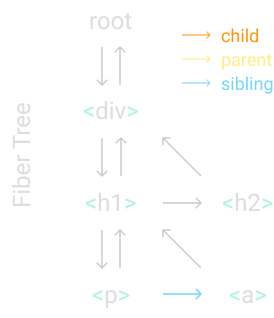
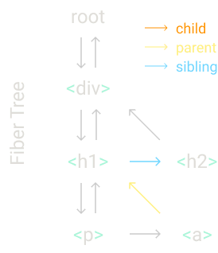

参考：https://pomb.us/build-your-own-react/
基于React 16.8实现，因而可以使用hook，不再书写使用过去的class相关的代码。

实现React的基本思路如下：
Step I: The createElement Function  第一步：创建节点
Step II: The render Function    第二步：渲染
Step III: Concurrent Mode     第三步：concurrent模式
Step IV: Fibers               第四步：Fiber“纤维”
Step V: Render and Commit Phases  第五步： 渲染和Commit阶段
Step VI: Reconciliation           第六步：调和
Step VII: Function Components   第七步：函数组件
Step VIII: Hooks                第八步：Hooks


# 第0步：回顾
下面是最简单的几行React代码：
```javascript
const element = <h1 title="foo">Hello</h1>
const container = document.getElementById("root")
ReactDOM.render(element, container) // 把element插入到页面的DOM节点container中
```
第一行代码替换成vanilla（香草？）JS代码，变化如下：
```javascript
// JSX 通过Babel编译成JS
// 一般转换过程都很简单：调用createElement把tag内的代码替换掉，传入tag名，属性和子节点作为参数
const element = <h1 title="foo">Hello</h1> 
// ========transformation=========
const element = React.createElement(
  "h1",
  { title: "foo" },
  "Hello"
)
// React.createElement 根据入参返回一个对象。中间还有一些校验。
// 所以我们可以直接将函数调用替换为函数最终的输出。
// 这就是React中一个element object，包含type和props两个字段（目前我们只关注这两个属性）
const element = {
    // type是一个字符串，表明我们想要创建的DOM节点的类型，和document.createElement方法中的tagName是一样的。type也可以是一个函数，这个留到第7步再作讲解。
    type: 'h1',
    // props是一个对象，它包含所有JSX属性的键值对。它还包含一个特殊的属性children。 
    props: {
        title: 'foo',
        // children在这里是一个字符串，但是它通常是一个数组，包含多个element。这也是elements也是树的原因。
        children: 'Hello' 
    }
};
```
然后还有第3行代码，这是React渲染/修改DOM的地方，现在由我们自己来实现这个更新。


首先我们根据React element的type去创建一个DOM节点node，在这个例子中是h1。
然后我们将element所有的属性prop添加到这个node上，这里暂时只有title。
```javascript
const node = document.createElement(element.type);
node['title'] = element.props.title;
```

然后我们为children创建DOM节点。这里只有一个文本作为child，所以我们创建为它创建一个text node。
```javascript
const text = document.createTextNode('');
// 用textNode而不是设置innerText会允许我们稍后用相同的方式来处理所有的elements。
// 同样要注意我们就像对h1设置title属性一样，对textNode设置nodeValue，就像这个字符串拥有自己的props: {nodeValue: "hello"}似的。
text['nodeValue'] = element.props.children;
```
最后，把text添加到h1 node中，把node添加到container中。
```javascript
node.appendChild(text);
container.appendChild(node);
```

现在，我们实现了之前依靠React JSX和React.render才实现的功能。
```javascript
const element = {
    type: 'h1',
    props: {
        title: 'foo',
        children: 'Hello' 
    }
};
const container = document.getElementById("root");
const node = document.createElement(element.type);
node['title'] = element.props.title;
const text = document.createTextNode('');
text['nodeValue'] = element.props.children;
node.appendChild(text);
container.appendChild(node);
```

# 第1步 createElement函数
现在，让我们用另一个app重新开始。
```javascript
const element = (
  <div id="foo">
    <a>bar</a>
    <b />
  </div>
)
const container = document.getElementById("root")
ReactDOM.render(element, container)
```
这次我们会用我们自己版本的React去替换原来的React。
我们从实现createElement函数开始。让我们将JSX转换为JS，从而看见createElement的调用。
```javascript
const element = React.createElement(
    'div',
    { id: 'foo' },
    [
        React.createElement('a', null, 'bar'),
        React.createElement('b')
    ]
)
```
正如我们上一步看到的那样，一个element是一个包含type和props两个属性的对象。所以我们的函数只需要执行创建对象的工作。
现在我们来实现createElement函数。
```javascript
//我们对props使用...扩展符号，对children使用剩余符号，这样children的值将一定是数组。
function createElement(type, props, ...children) {
    return {
        type,
        props: {
            ...props,
            children
        }
    }
}
const element = createElement('div');
// { type: 'div', props: { children: [] } }
const a = createElement('div', null, a);
// { type: 'div', props: { children: [a] } }
const c = createElement('div', null, a, b);
// { type: 'div', props: { children: [a, b] } }
```
children数组也可以包含基本类型，比如字符串或数字。所以我们会将非对象的类型包裹在一个element中，并创建一个特殊type，名叫TEXT_ELEMENT。
```javascript
function createElement(type, props, ...children) {
    return {
        type,
        props: {
            ...props,
            children: children.map(child => {
                typeof child === 'object' ? child : createTextElement(child)
            })
        }
    }
}
function createTextElement(text) {
    return {
        type: 'TEXT_ELEMENT',
        props: {
            nodeValue: text,
            children: []
        }
    }
}
```
注意，React源码并没有像这样包裹基本类型值或在没有children时创建空数组，但我们这样做可以简化代码。对于我们的库，我们更喜欢简单的代码，而非高性能的代码。

上文我们还在用React.createElement。现在，我们用Didact来替换React，表明为我们自己实现的库。目前，让它包含上面刚刚实现的createElement方法。
```javascript
const Didact = {
    createElement
}
const element = Didact.createElement(
    'div',
    { id: 'foo' },
    [
        Didact.createElement('a', null, 'bar'),
        Didact.createElement('b')
    ]
)
```
上面是编译后的JS代码。在这之前，我们还是得用JSX。那么我们怎么让babel知道要编译成Didact.createElement而不是React的createElement呢？
像这样注释，当babel编译JSX时它就会用我们定义的函数。
```javascript
/** @jsx Didact.createElement */
const element = (
  <div id="foo">
    <a>bar</a>
    <b />
  </div>
)
```

# 第2步 render函数
创建好了element，现在我们要实现自己的render函数，将一个object转换为DOM节点并添加到container中：
```javascript
ReactDOM.render(element, container)
```
现在，我们只关注添加节点到DOM中。我们稍后会再处理update和delete操作。
```javascript
const Didact = {
    createElement,
    render
}
function render(element, container) {
    // TODO create dom nodes
}
// ...jsx
// const container = document.getElementById('root')
Didact.render(element, container);
```

我们从根据type创建一个DOM node，然后将该node添加到container中开始：
```javascript
function render(element, container) {
    // 在这里也要对text节点特殊处理，如果type为之前设定的TEXT_ELEMENT，则需要调用createTextNode方法
    const dom = element.type === 'TEXT_ELEMENT' ? document.createTextNode('') : document.createElement(element.type);
    
    // 还记得每个element的属性吗？除了children，其余的属性都要绑定到对应的DOM node上
    const isProperty = key => key !== 'children';
    Object.keys(element.props).filter(isProperty).forEach(name => {
        dom[name] = element.props[name];
    });

    // 然后对element的每个子节点做递归操作，生成DOM node并添加到该element对应的DOM node中，形成真正的DOM树
    element.children.forEach(child => {
        render(child, dom);
    });
    container.appendChild(dom);
}
```
完成。现在我们有了一个可以将JSX转译为DOM的库了。https://codesandbox.io/s/didact-2-k6rbj?file=/src/index.js


# 第3步 concurrent模式
在添加更多代码前，我们需要做个重构。上面的forEach render递归调用存在一个问题，就是当element树太大时，它可能会阻断主线程太久。
而且，如果浏览器需要执行高优先级的工作，例如提交用户输入，或者保障动画流畅播放，那么浏览器就要等到它完成渲染。

所以我们要将渲染工作拆分成小的单元，每执行完一个，浏览器发现还有别的是事情要做的话就会中断渲染。
```javascript
// 我们用requestIdleCallback来建立一个循环。你可以把它看作setTimeout，但是不是由我们去告诉它什么时候运行，而是由浏览器在主线程空闲是去执行callback。

// React不再使用requestIdleCallback。现在它使用scheduler package。但是在这个用例中它们的概念是类似的。
let nextUnitOfWork = null;
// 入参deadline可以用来检查在浏览器需要重新take control之前我们还有多少时间去执行渲染
function workLoop(deadline) {
    let shouldYield = false;
    // 如果还有任务 && 当前帧还有空闲
    while (nextUnitOfWork && !shouldYield) {
        nextUnitOfWork = performUnitOfWork(nextUnitOfWork);
        shouldYield = deadline.timeRemaing() < 1
    }
    requestIdleCallback(workLoop) // 等待下一帧
}
requestIdleCallback(workLoop) // 启动时间切片
function performUnitOfWork(nextUnitOfWork) {
    // TODO
}
```
As of截至2019年11月, Concurrent Mode还没有发布稳定版本。循环的稳定版本更像是下面这样：
```javascript
while (nextUnitOfWork) {    
  nextUnitOfWork = performUnitOfWork(   
    nextUnitOfWork  
  ) 
}
```
要开始使用这个循环，我们需要设置任务的第一个单元，然后编写performUnitOfWork方法，这个方法不仅执行当前的任务，还会返回下一个单元的任务。


# 第4步 fiber树
我们需要一种形如纤维树的数据结构来组织单元任务。每个React element，都会有一个对应的fiber，它们是一一对应的关系。

举个例子：
假设我们要渲染一个像这样的element树结构到DOM中：
```javascript
Didact.render(
  <div>
    <h1>
      <p />
      <a />
    </h1>
    <h2 />
  </div>,
  container
)
```

在render函数中我们会创建根fiber，然后将其设为nextUnitOfWork。其余的工作会在performUnitOfWork中进行，在该函数中我们会对每个fiber做以下三件事：

1. add the element to the DOM 将element添加到DOM
2. create the fibers for the element’s children 为这个fiber的children创建它们自己的fiber
3. select the next unit of work 选择下一个单元任务
   
这样类似纤维的数据结构的一个好处就是由于每个fiber都和自己的第一个子节点、相邻节点和父节点有一个连接，可以很容易确认下一个单元任务，即下一个要进行渲染的element。

* 当我们完成了对一个fiber的任务的执行，如果这个fiber有子节点，那么这个子节点就会成为下一个单元任务。对于本例，当我们完成div这个fiber的工作，下一个单元任务将会是h1这个fiber。

* 如果当前的fiber没有子节点，我们会让它的相邻节点成为下个单元任务。例如，p这个fiber没有子节点，所以我们会在完成渲染它之后移动到a这个fiber。


* 而如果这个fiber没有子节点也没有相邻节点，我们会去找它的“叔叔”：父节点的相邻节点，例如本例中的h2。

另外，如果父节点没有相邻节点，我们继续向上沿着父节点寻找，直到找到了有相邻节点的父节点，或者是到达根节点。如果我们到达了根节点，则说明我们已经完成了对这次render的所有任务。

现在让我们用代码进行实现吧！

首先将原先render函数里的创建DOM的代码抽离出来：
```javascript
function render(element, container) {
    // 创建DOM
    const dom = element.type === 'TEXT_ELEMENT' ? document.createTextNode('') : document.createElement(element.type);
    const isProperty = key => key !== 'children';
    Object.keys(element.props).filter(isProperty).forEach(name => {
        dom[name] = element.props[name];
    });

    // 对子节点递归调用
    element.children.forEach(child => {
        render(child, dom);
    });
    // 添加到容器中
    container.appendChild(dom);
}
```
将创建DOM的部分抽离出来形成一个新的方法createDOM，入参为fiber，即element。稍后我们会用到这个方法。
```javascript
function createDom(fiber) {
    const dom = fiber.type === 'TEXT_ELEMENT' ? document.createTextNode('') : document.createElement(fiber.type);
    const isProperty = key => key !== 'children';
    Object.keys(fiber.props)
        .filter(isProperty)
        .forEach(name => {
            dom[name] = fiber.props[name];
        });
    return dom;
}
```
然后，在render方法中，我们把fiber树的根节点作为nextUnitOfWork:
```javascript
function render (element, container) {
    // 最初最初的节点为container，一个已有的DOM节点，放在nextUnitOfWork，即fiber的dom属性中
    // nextUnitOfWork对象还有type属性，最初节点没有自身属性，只有children，包含一个我们创建好的element
    let nextUnitOfWork = {
        dom: container,
        props: {
            children: [element]
        }
    }
}

let nextUnitOfWork = null
```
然后，当浏览器ready后，它会调用我们上面所写的workLoop方法，我们就会开始从root进行渲染工作。
现在我们来实现performUnitOfWork方法。
```javascript
function performUnitOfWork(fiber) {
    // 1. 首先，我们创建一个新的DOM node，并将其添加到DOM中
    // 我们用fiber.dom属性去追踪DOM节点信息
    if (!fiber.dom) {
        fiber.dom = createDom(fiber);
    }
    if (fiber.parent) {
        fiber.parent.dom.appendChild(fiber.dom);
    }

    // 2. 然后我们为每一个子节点创建一个新的fiber
    const elements = fiber.props.children;
    let prevSibling = null;
    for (let i = 0; index < elements.length; i++) {
        const element = elements[i];
        const newFiber = {
            type: element.type,
            props: element.props,
            dom: null,
            parent: fiber
        }
        // 建立fiber连接，根据索引是否为0设置为当前fiber的child或是上一个子节点的相邻节点
        if (i === 0) {
            fiber.child = newFiber;
        } else {
            prevSibling.sibling = newFiber;
        }
        prevSibling = newFiber;
    }

    // 3. 最后我们搜索并确立下一个单元任务。我们先试试子节点child，没有child的话就相邻节点=》父节点的相邻节点这样循环搜索。
    if (fiber.child) {
        return fiber.child;
    }
    let nextFiber = fiber;
    while (nextFiber) {
        if (nextFiber.sibling) {
            return nextFiber.sibling;
        }
        nextFiber = nextFiber.parent;
    }
}
```
以上就是performUnitOfWork方法的实现。


# 第5步：Render和Commit阶段
现在我们还面临一个问题。每次我们对一个element进行操作时，都会将一个新的node节点那添加到DOM中，但是记住，浏览器可以在我们完成渲染整个树结构之前中断渲染工作去执行更高优先级的任务，在那种情况下，用户会看见一个不完整的UI。我们不希望那种情况发生。所以我们需要将修改DOM的代码片段抽离出来。
```javascript
function performUnitOfWork(fiber) {
    // ...
    // 修改DOM，需要提出去
    if (fiber.parent) {
        fiber.parent.dom.appendChild(fiber.dom);
    }
    // ...
}
```
反之，我们需要持续跟踪fiber树的根。我们称它为work in progress root或wipRoot。在render方法中重新命名：
```javascript
function render (element, container) {
    wipRoot = {
        dom: container,
        props: {
            children: [element]
        }
    }
    nextUnitOfWork = wipRoot;
}
let nextUnitOfWork = null;
let wipRoot = null;
```
然后，当我们完成了所有的渲染工作（不存在下一个单元任务时）我们将整个fiber树提交到DOM中（每个fiber都已经带有了它对应要渲染到document上的附带属性的DOM节点）。
```javascript
function commitRoot() {
  // TODO add nodes to dom
}
function render(element, container) {
  wipRoot = {
    dom: container,
    props: {
      children: [element],
    },
  }
  nextUnitOfWork = wipRoot
}
​
let nextUnitOfWork = null
let wipRoot = null
​
function workLoop(deadline) {
  let shouldYield = false
  while (nextUnitOfWork && !shouldYield) {
    nextUnitOfWork = performUnitOfWork(
      nextUnitOfWork
    )
    shouldYield = deadline.timeRemaining() < 1
  }
​  // 没有下一个单元任务，说明fiber树构建完成，整体提交到DOM中
  if (!nextUnitOfWork && wipRoot) {
    commitRoot()
  }
  requestIdleCallback(workLoop)
}
​
requestIdleCallback(workLoop)
```
我们在commitRoot方法中实现提交功能。在commitWork里递归添加所有node到DOM树中。
```javascript
function commitRoot() {
    // 这里child就是实际要添加到已有DOM容器节点的根element
    commitWork(wipRoot.child);
    wipRoot = null;
}
function commitWork(fiber) {
    if (!fiber) {
        return;
    }
    const fiberParentDom = fiber.parent.dom;
    fiberParentDom.appendChild(fiber.dom);
    commitWork(fiber.child);
    commitWork(fiber.sibling);
}
```

# 第6步：Reconciliation 调和 （DIFF算法）
目前为止我们只是完成了添加节点到DOM的实现，那么更新和删除节点呢？
这就是我们现在要做的，将我们在render方法中接收到的elements和上一个我们提交到DOM的fiber树进行对比。

所以我们需要将上一个完成渲染的fiber树保存到一个引用当中，我们叫它currentRoot。
同时，对每一个fiber添加一个alternate属性。这个属性是对旧fiber的链接，即我们在上一个从commit阶段提交到DOM的fiber。

```javascript
let nextUnitOfWork = null;
let currentRoot = null;
let wipRoot = null;
function render(element, container) {
  wipRoot = {
    dom: container,
    props: {
      children: [element],
    },
    // 添加alternate属性存储上一次渲染的对应的fiber
    alternate: currentRoot
  }
  nextUnitOfWork = wipRoot
}
function commitRoot() {
    // 这里child就是实际要添加到已有DOM容器节点的根element
    commitWork(wipRoot.child);
    currentRoot = wipRoot;
    wipRoot = null;
}
function commitWork(fiber) {
    if (!fiber) {
        return;
    }
    const fiberParentDom = fiber.parent.dom;
    fiberParentDom.appendChild(fiber.dom);
    commitWork(fiber.child);
    commitWork(fiber.sibling);
}
```
现在让我们把performUnitOfWork中创建新fiber的代码抽离出来：
```javascript
function performUnitOfWork(fiber) {
  if (!fiber.dom) {
    fiber.dom = createDom(fiber)
  }
​
  const elements = fiber.props.children
  let index = 0
  let prevSibling = null
​
  while (index < elements.length) {
    const element = elements[index]
​
    const newFiber = {
      type: element.type,
      props: element.props,
      parent: fiber,
      dom: null,
    }
​
    if (index === 0) {
      fiber.child = newFiber
    } else {
      prevSibling.sibling = newFiber
    }
    prevSibling = newFiber
    index++
  }
​
  if (fiber.child) {
    return fiber.child
  }
  let nextFiber = fiber
  while (nextFiber) {
    if (nextFiber.sibling) {
      return nextFiber.sibling
    }
    nextFiber = nextFiber.parent
  }
}
```

```javascript
function performUnitOfWork(fiber) {
  if (!fiber.dom) {
    fiber.dom = createDom(fiber)
  }
  const elements = fiber.props.children
  // 当前的fiber和它的子节点们，调用构建fiber树结构函数reconcileChildren
  reconcileChildren(fiber, elements)
  if (fiber.child) {
    return fiber.child
  }
  let nextFiber = fiber
  while (nextFiber) {
    if (nextFiber.sibling) {
      return nextFiber.sibling
    }
    nextFiber = nextFiber.parent
  }
}
function reconcileChildren(wipFiber, elements) {
  let index = 0
  let prevSibling = null
​
  while (index < elements.length) {
    const element = elements[index]
​
    const newFiber = {
      type: element.type,
      props: element.props,
      parent: wipFiber,
      dom: null,
    }
    if (index === 0) {
      wipFiber.child = newFiber
    } else {
      prevSibling.sibling = newFiber
    }
    prevSibling = newFiber
    index++
  }
}
```

继续修改reconcileChildren，这里我们会将旧的fibers和新的elements进行调和。
We iterate at the same time over the children of the old fiber (wipFiber.alternate) and the array of elements we want to reconcile.

如果我们忽略所有在一个数组和一个链表上同时遍历的样板代码（boilerplate）。我们会得到这里面最重要的两个变量：oldFiber和element。

我们需要对比这两个变量，即这次要渲染的fiber的子fiber和上次的子fiber，来确认我们时候要将什么变化应用到DOM上。

我们用type来比较它们:

* 如果旧fiber和新element的type相同，我们可以让DOM node留在那里，只更新一些新的属性。
* 如果type不同，有一个新的element，这意味着我们需要创建一个新的node
* 如果type不同，有一个旧的fiber，我们需要移除掉旧的DOM node

这里React也使用keys这个属性，这让调和效果更好。例如，它会发现子节点们在element数组中的排列顺序的改变。

```javascript
function reconcileChildren(wipFiber, elements) {
  let index = 0
  // 上次渲染到DOM的对应节点的子fiber
  let oldFiber = wipFiber.alternate && wipFiber.alternate.child;
  let prevSibling = null
​
  // 循环条件增加oldFiber不为空
  while (index < elements.length && oldFiber !== null) {
    // element是现在要渲染到DOM上的节点的子fiber
    const element = elements[index]
​    let newFiber = null;

    // 将旧fiber和现element进行比较
    const sameType = element && oldFiber && element.type === oldFiber.type;
    // 更新节点
    if (sameType) {
        // 创建一个新的fiber，维持旧fiber的dom，设置新element的props
        // 同时添加一个新属性effectTag，这个属性会在稍后的commit阶段用到
        newFiber = {
            type: oldFiber.type,
            props: element.props,
            dom: oldFiber.dom,
            parent: wipFiber,
            effectTag: 'UPDATE',
            alternate: oldFiber
        }
    // 添加新节点
    } else if (!sameType && element) {
        // 对于element需要一个新的DOM节点的case，我们对新fiber添加一个值为PLACEMENT的tag
        newFiber = {
            type: element.type,
            props: element.props,
            dom: null,  // 后面会用fiber来调用createDom，这里只是将element转为fiber
            parent: wipFiber,
            effectTag: 'PLACEMENT',
            alternate: null
        }
    // 删除旧节点
    } else if (!sameType && oldFiber) {
        // 对于要删除node的case，我们没有新的fiber，所以对旧fiber添加一个DELETION的tag。
        oldFiber.effectTag = 'DELETION';
        // 但是，由于我们是从wipRoot提交fiber树到DOM中的，这个fiber树结构已经不再包含旧的fiber了
        // 所以我们需要一个数组deletions来记录我们要移除的node节点
        deletions.push(oldFiber);
    }
    if (index === 0) {
      wipFiber.child = newFiber
    } else {
      prevSibling.sibling = newFiber
    }
    prevSibling = newFiber
    index++
  }
}
function render(element, container) {
  wipRoot = {
    dom: container,
    props: {
      children: [element],
    },
    alternate: currentRoot,
  }
  // 每次开始渲染时，初始化要移除的node节点为空数组
  deletions = []
  nextUnitOfWork = wipRoot
}
let nextUnitOfWork = null
let currentRoot = null
let wipRoot = null
let deletions = null

// 然后，当我们将变更提交到DOM时，我们也对那个数组中的fiber调用commitWork。
function commitRoot() {
  deletions.forEach(commitWork)
  commitWork(wipRoot.child)
  currentRoot = wipRoot
  wipRoot = null
}
​
```

接下来要修改commitWork方法来处理上面增加的effectTag：
```javascript
function commitWork(fiber) {
    if (!fiber) {
        return;
    }
    const domParent = fiber.parent.dom;
    // 如果fiber有PLACEMENT这个effect tag我们就和之前一样，添加fiber的dom节点到它的parent的dom节点中去。
    if (fiber.effectTag === 'PLACEMENT' && fiber.dom !== null) {
        domParent.appendChild(fiber.dom)
        // 如果是UPDATE，那么就将新fiber的props更新到已有的dom节点中
        // 并且替换掉之前已有的props的值
    } else if (fiber.effectTag === 'UPDATE' && fiber.dom !== null) {
        updateDom(
            fiber.dom,
            fiber.alternate.props,
            fiber.props
        )
      // 如果是DELETION，我们就做相反操作，移除子节点
    } else if (fiber.effectTag === 'DELETION') {
        domParent.removeChild(fiber.dom)
    }
    commitWork(fiber.child);
    commitWork(fiber.sibling);
}
```

接下来要实现updateDom方法。我们将旧fiber和新fiber的props进行比较，移除那些不再有的props，并且设置那些新的props或者是变化了的值的props。
```javascript
// 是新值或者是全新的prop
const isNew = (prev, next) => key => prev[key] !== next[key]
const isGone = (prev, next) => key => !(key in next);
// 注意，还有一种特殊prop我们可能需要更新的是event listener。所以如果以on为开头的prop我们需要对它们进行特殊处理。
const isEvent = key => key.startsWith('on')
const isProperty = key => key !== 'children' && !isEvent(key);
function updateDom(dom, prevProps, nextProps) {
    // 如果事件监听器变了，或者不再有，那么我们需要先移除掉旧的。
    Object.keys(prevProps)
        .filter(isEvent)
        .filter(
            key =>
                !(key in nextProps) ||
                isNew(prevProps, nextProps)(key)
        )
        .forEach(name => {
            const eventType = name.toLowerCase().substring(2);
            dom.removeEventListener(eventType, prevProps[name]);
        })
    // 移除旧的property
    Object.keys(prevProps)
        .filter(isProperty)
        .filter(isGone(prevProps, nextProps))
        .forEach(name => {
            dom[name] = '';
        })
    // 设置新的或值变了的property
    Object.keys(nextProps)
        .filter(isProperty)
        .filter(isNew(prevProps, nextProps))
        .forEach(name => {
            dom[name] = nextProps[name];
        })
    // 然后添加新fiber的事件监听器
    Object.keys(nextProps)
        .filter(isEvent)
        .filter(isNew(prevProps, nextProps))
        .forEach(name => {
            const eventType = name.toLowerCase().substring(2);
            dom.addEventListener(eventType, nextProps[name]);
        })
}
```
至此，我们完成了调和工作啦！
尝试地址：https://codesandbox.io/s/didact-6-96533


# 第7步：函数组件
我们下一步要做的就是添加对函数式组件的支持。
首先让我们来修改一下例子。我们会用这个简单的返回一个h1元素的函数组件。
```javascript
// 普通写法，没有带自定义组件
const element = (
  <div id="foo">
    <a>bar</a>
    <b />
  </div>
)
// 函数式组件写法
/** @jsx Didact.createElement */
function App(props) {
  return <h1>Hi {props.name}</h1>
}
const element = <App name="foo" />
const container = document.getElementById("root")
Didact.render(element, container)
```

我们将这段jsx代码转译成js，就会变成：
```javascript
function App(props) {
  return Didact.createElement(
    "h1",
    null,
    "Hi ",
    props.name
  )
}
const element = Didact.createElement(App, {
  name: "foo",
})
```
函数式组件在两个方面有所区别：
* 源自函数组件的fiber没有DOM节点
* 子节点们是在运行函数时得来的，而不是直接从props中得来

因此在performUnitOfWork方法中，我们重构创建dom和获取子节点的代码段，改为检查fiber的type是否是function，并根据判断结果去执行不同的update方法。

```javascript
function performUnitOfWork(fiber) {
    // if (!fiber.dom) {
    //     fiber.dom = createDom(fiber)
    // }
    // const elements = fiber.props.children
    // // 当前的fiber和它的子节点们，调用构建fiber树结构函数reconcileChildren
    // reconcileChildren(fiber, elements)
    const isFunctionComponent =
        fiber.type instanceof Function
    if (isFunctionComponent) {
        updateFunctionComponent(fiber)
    } else {
        updateHostComponent(fiber)
    }
    // 遍历fiber链表
    if (fiber.child) {
        return fiber.child
    }
    let nextFiber = fiber
    while (nextFiber) {
        if (nextFiber.sibling) {
        return nextFiber.sibling
        }
        nextFiber = nextFiber.parent
    }
}
​
// 在updateHostComponent中我们会和之前做一样的事情
function updateHostComponent(fiber) {
    if (!fiber.dom) {
        fiber.dom = createDom(fiber)
    }
    const elements = fiber.props.children
    // 当前的fiber和它的子节点们，调用构建fiber树结构函数reconcileChildren
    reconcileChildren(fiber, elements)
}
```
在updateFunctionComponent函数中我们执行获取组件本身（函数）来获取其子节点。
对于我们的例子，在这里fiber.type是App这个方法，而当我们去执行它，它会返回h1 这个element。
然后，一旦我们获取到了子节点，reconciliation以一样的方式工作，我们不需要在那里修改任何东西。
```javascript
function updateFunctionComponent(fiber) {
  const children = [fiber.type(fiber.props)]
  reconcileChildren(fiber, children)
}
```

现在我们需要修改commitWork这个方法。有了不带DOM节点的fiber，所以我们需要修改两个地方。
首先，要找到父fiber的DOM节点我们需要沿着fiber树向上走，知道找到一个拥有DOM node的fiber。
```javascript
// const domParent = fiber.parent.dom;
 let domParentFiber = fiber.parent
  while (!domParentFiber.dom) {
    domParentFiber = domParentFiber.parent
  }
  const domParent = domParentFiber.dom
```
另外，删除一个节点是也是要沿着fiber树向下寻找child，到找到了有DOM node的fiber。
```javascript
else if (fiber.effectTag === 'DELETION') {
    commitDeletion(fiber, domParent)
}
function commitDeletion(fiber, domParent) {
    if (fiber.dom) {
        domParent.removeChild(fiber);
    } else {
        commitDeletion(fiber.child, domParent);
    }
}
/** @jsx Didact.createElement */
function App(props) {
  return <h1>Hi {props.name}</h1>
}
const element = <App name="foo" />
const container = document.getElementById("root")
Didact.render(element, container)
```

# 第8步 Hooks
最后一步。既然我们有了函数组件，那么让我们也加下state。
让我们将例子更改为经典的counter组件。每次我们点击它，它都会将state加1。请注意我们在使用Didact.useState来获取和更新counter的值。
```javascript
const Didact = {
  createElement,
  render,
  useState,
}

/** @jsx Didact.createElement */
function Counter() {
  // Here is where we call the Counter function from the example. And inside that function we call useState.
  const [state, setState] = Didact.useState(1)
  return (
    <h1 onClick={() => setState(c => c + 1)}>
      Count: {state}
    </h1>
  )
}
const element = <Counter />
const container = document.getElementById("root")
Didact.render(element, container)

function useState(initial) {
  // TODO
}
```

在调用函数组件之前，我们需要初始化一些全局变量，这样我们就能在useState方法中使用它们。
首先我们设置工作中的fiber。
我们同样添加一个hooks数组到fiber中，来支持在同一个组件中多次调用useState。并且我们保持跟踪现在的hook索引。
```javascript
let wipFiber = null;
let hookIndex = null;
function updateFunctionComponent(fiber) {
    // 在更新函数组件的方法中初始化hooks
    wipFiber = fiber;
    hookIndex = 0;
    wipFiber.hooks = [];
    const children = [fiber.type(fiber.props)];
    reconcileChildren(fiber, children);
}
```
当函数组件调用useState方法时，我们去检查是否有一个旧的hook。我们用hook索引去到这个fiber的alternate中检查。

如果我们有一个旧的hook，我们将旧hook中的state复制到新的hook中；如果我们没有，那么就初始化这个state。

然后我们添加这个新的hook到fiber中，给hook索引加1，然后返回这个state。
```javascript
function useState(initial) {
    const oldHook = wipFiber && wipFiber.alternate.hooks && wipFiber.alternate.hooks[hookIndex];
    const hook = {
        state: oldHook ? oldHook.state : initial
    }
    wipFiber.hooks.push(hook);
    hookIndex++;
    return [hook.state];
}
```
useState还应该返回一个更新state的函数，所以我们定义一个setState方法，这个方法接收一个action（对于Counter例子而言，这个action就是一个让state加1的函数）。
我们将那个action添加到hook的queue队列中。
然后我们做一些和在render函数中所做的类似的事情：设置一个新的工作中root，作为下一个单元任务，这样work loop就能开始一个新的render阶段。

注意我们还没有执行action。

我们在下一次render组件时执行。从旧的hook的queue中获取所有actions，然后将它们逐一运用到新的hook state中，因此当我们最终返回state时它是更新过的。
```javascript
function useState(initial) {
    const oldHook = wipFiber && wipFiber.alternate.hooks && wipFiber.alternate.hooks[hookIndex];
    const hook = {
        state: oldHook ? oldHook.state : initial,
        queue: [], // queue存放setState的入参，表示一个修改state的函数
    }
    // 执行actions
    const actions = oldHook ? oldHook.queue : [];
    actions.forEach(action => {
        hook.state = action(hook.state);
    })
    const setState = action => {
        hook.queue.push(action);
        // 浏览器空闲时进行重新performUnitOfWork
        wipRoot = {
            dom: currentRoot.dom,
            props: currentRoot.props,
            alternate: currentRoot
        }
        nextUnitOfWork = wipRoot;
        deletions = [];
    }
    wipFiber.hooks.push(hook);
    hookIndex++; // hooks一定要有顺序
    return [hook.state, setState];
}
```
以上就是我们自行实现的版本的React啦！
在线版本：https://codesandbox.io/s/didact-8-21ost

# 后记
Besides helping you understand how React works, one of the goals of this post is to make it easier for you to dive deeper in the React codebase. That’s why we used the same variable and function names almost everywhere.

For example, if you add a breakpoint in one of your function components in a real React app, the call stack should show you:

* workLoop
* performUnitOfWork
* updateFunctionComponent

We didn’t include a lot of React features and optimizations. For example, these are a few things that React does differently:

* In Didact, we are walking the whole tree during the render phase. React instead follows some hints and heuristics to skip entire sub-trees where nothing changed.
* We are also walking the whole tree in the commit phase. React keeps a linked list with just the fibers that have effects and only visit those fibers.
* Every time we build a new work in progress tree, we create new objects for each fiber. React recycles the fibers from the previous trees.
* When Didact receives a new update during the render phase, it throws away the work in progress tree and starts again from the root. React tags each update with an expiration timestamp and uses it to decide which update has a higher priority.
* And many more…

There are also a few features that you can add easily:

* use an object for the style prop
* flatten children arrays
* useEffect hook
* reconciliation by key

If you add any of these or other features to Didact send a pull request to the GitHub repo, so others can see it.
https://github.com/pomber/didact