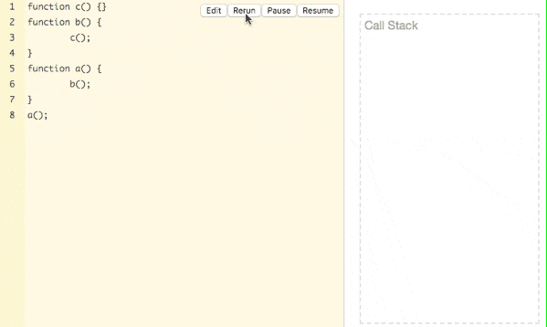
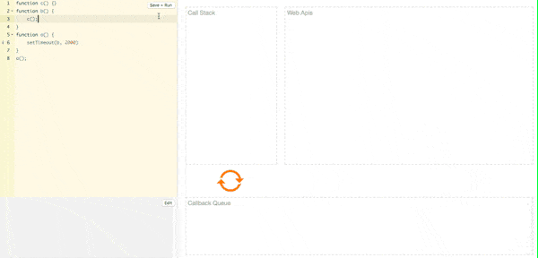
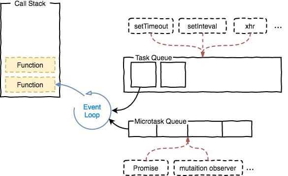
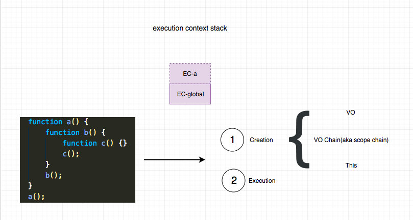
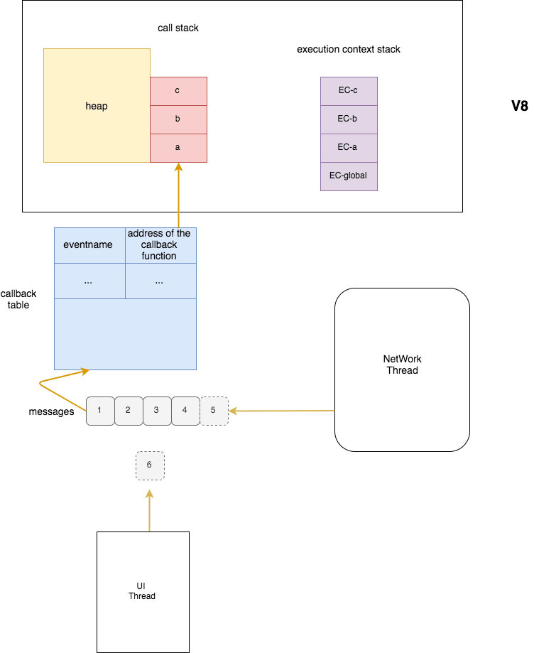

## 事件模型
不论是浏览器还是Node.js，都有自己的事件模型，它们都是事件驱动的，即依靠事件来维持运行。
现在比较推荐的绑定事件的方法是addEventListener：
```javascript
target.addEventListener(type, listener[, options]);
target.addEventListener(type, listener[, useCapture]);
target.addEventListener(type, listener[, useCapture, wantsUntrusted  ]); // Gecko/Mozilla only
```
旧版本的第三个参数是bool，表示是否是捕获阶段，默认是false，即默认为冒泡阶段。新版本是一个对象，其中有capture（和上面功能一样），passive和once。once用来执行是否只执行一次，passive如果被指定为true, 表示永远不会执行preventDefault(),这在实现丝滑柔顺的滚动的效果中很重要。[Improving scrolling performance with passive listeners](https://developer.mozilla.org/en-US/docs/Web/API/EventTarget/addEventListener#Improving_scrolling_performance_with_passive_listeners)

### 框架中的事件
框架中的事件
实际上，我们现在大多数情况都是用框架来写代码，因此上面的情况其实在现实中是非常少见的，我们更多看到的是框架封装好的事件，比如React的合成事件，感兴趣的可以看下这几篇文章。

* [React SyntheticEvent](https://reactjs.org/docs/events.html)
* [Vue和React的优点分别是什么？两者的最核心差异对比是什么？](https://developer.51cto.com/art/201907/599732.htm)  

虽然我们很少时候会接触到原生的事件，但是了解一下事件对象，事件机制，事件代理等还是很有必要的，因为框架的事件系统至少在这方面还是一致的，这些内容我们接下来就会讲到。

### 事件对象
```javascript
function handleClick(e: Event) {
    // ...
}
```
这个e就是事件对象，它包含一些重要属性和方法：  
* 属性
1. target
2. x, y等位置信息
3. timeStamp
4. eventPhase


* 方法
1. preventDefault 用于阻止浏览器的默认行为，比如a标签会默认进行跳转，form会默认校验并发送请求到action指定的地址等
2. stopPropagation 用于阻止事件的继续冒泡行为，后面讲事件传播的时候会提到。

## 事件循环
事件指的是其所处理的对象就是事件本身，每一个浏览器都至少有一个事件循环，一个事件循环至少有一个任务队列。循环指的是其永远处于一个“无限循环”中。不断将注册的回调函数推入到执行栈。
一段JS代码，需要被编译成机器可理解并执行的指令，这就依赖JS引擎。而V8引擎中，有两个核心组成，即**执行栈**和**堆**。执行栈中存放正在执行的代码段，堆中存放变量的值。以一段简单代码为例：
```javascript
function c() {}
function b() {
	c();
}
function a() {
	b();
}a();
```
代码执行的过程可以用动图表示：


### DOM和Web API
JS对应的ECMA规范，V8只有堆和栈，用来实现ECMA规范，它与DOM（文档对象模型，其提供了一系列可以供JS调用的接口）、Web API、事件循环等执行环境如浏览器包含的内容不相关。
JS执行栈与渲染线程互相阻塞，为的是避免并行时JS获取DOM信息之后对DOM进行操作，而DOM本身同时也发生了变化，这样就会导致错乱和冲突。

### 单线程同步、多线程同步、异步
```javascript
fetchUserInfoSync().then(doSomethingA); // 1s
fetchMyArcticlesSync().then(doSomethingB);// 3s
fetchMyFriendsSync().then(doSomethingC);// 2s
```
在单线程的情况下，由于JS与渲染线程互相阻塞，因此发出三个接口异步请求时后续代码都被阻塞，数据需要耗时6s，这显然是不可接受的；
在多线程的情况下，最理想状态下需要耗时3s，但是因为三个线程都可以访问DOM和堆内存，很可能造成冲突，若要避免冲突就要设计锁🔒，这样会导致代码模型更加复杂，耗时必然大于3s；
在异步的情况下，就涉及到**事件循环**。

### 事件循环如何实现异步
事件循环在浏览器和NodeJs中都是用于调度的，它决定了V8什么时候执行什么代码。**V8只是负责JS代码的解析和执行，其他一概不知。** 浏览器或者NodeJS中触发事件之后，到事件的监听函数被V8执行这个时间段的所有工作都是事件循环在起作用。
我们来小结一下：

对于V8来说，它有：
调用栈（call stack）
这里的单线程指的是只有一个call stack。只有一个call stack 意味着同一时间只能执行一段代码。

堆（heap）
对于浏览器运行环境来说：
WEB API
DOM API
任务队列
事件来触发事件循环进行流动

事件循环之所以可以实现异步，就是将类似setTimeout等异步执行的代码注册/绑定的回调函数存起来，后面再将任务推入执行栈中。如图所示：
```javascript
function c() {}
function b() {
	c();
}
function a() {
	setTimeout(b, 2000)
}
a();
```


加入用户交互之后，可见示例：
http://latentflip.com/loupe/?code=JC5vbignYnV0dG9uJywgJ2NsaWNrJywgZnVuY3Rpb24gb25DbGljaygpIHsKICAgIHNldFRpbWVvdXQoZnVuY3Rpb24gdGltZXIoKSB7CiAgICAgICAgY29uc29sZS5sb2coJ1lvdSBjbGlja2VkIHRoZSBidXR0b24hJyk7ICAgIAogICAgfSwgMjAwMCk7Cn0pOwoKY29uc29sZS5sb2coIkhpISIpOwoKc2V0VGltZW91dChmdW5jdGlvbiB0aW1lb3V0KCkgewogICAgY29uc29sZS5sb2coIkNsaWNrIHRoZSBidXR0b24hIik7Cn0sIDUwMDApOwoKY29uc29sZS5sb2coIldlbGNvbWUgdG8gbG91cGUuIik7!!!PGJ1dHRvbj5DbGljayBtZSE8L2J1dHRvbj4%3D

setTimeout代码执行后会将回调函数放入Web API中，计时结束后注册的回调函数会插入Callback queue中，待到Call Stack为空即浏览器空闲的时候时排队插入Call Stack被执行。

加入**宏任务**和**微任务**，来看一个更复杂的例子：
```javascirpt
console.log(1)

setTimeout(() => {
  console.log(2)
}, 0)

Promise.resolve().then(() => {
	return console.log(3)
}).then(() => {
	console.log(4)
})

console.log(5)
```
上面的代码会输出：1、5、3、4、2。 如果你想要非常严谨的解释可以参考 whatwg 对其进行的描述 [cievent-loop-processing-model](https://html.spec.whatwg.org/multipage/webappapis.html#event-loop-processing-model)。

下面我会对其进行一个简单的解释。

* 浏览器首先执行宏任务，也就是我们script（仅仅执行一次）
* 完成之后检查是否存在微任务，然后不停执行，直到清空队列
* 执行宏任务
其中：

宏任务主要包含：setTimeout、setInterval、setImmediate、I/O、UI交互事件

微任务主要包含：Promise、process.nextTick、MutaionObserver 等

  

有了这个知识，我们不难得出上面代码的输出结果。

由此我们可以看出，宏任务&微任务只是实现异步过程中，我们对于信号的处理顺序不同而已。如果我们不加区分，全部放到一个队列，就不会有宏任务&微任务。这种人为划分优先级的过程，在某些时候非常有用。

### 加入执行上下文栈
说到执行上下文，就不得不提到浏览器执行JS函数其实是分两个过程的。一个是**创建阶段Creation Phase**，一个是**执行阶段Execution Phase**。

同执行栈一样，浏览器每遇到一个函数，也会将当前函数的执行上下文栈推入栈顶。

```javascript
function a(num) {
	function b(num) {
		function c(num) {
			const n = 3
			console.log(num + n)
		}
		c(num);
	}
	b(num);
}
a(1);
```
遇到上面的代码。 首先会将a的压入执行栈，我们开始进行创建阶段Creation Phase， 将a的执行上下文压入栈。然后初始化a的执行上下文，分别是**VO，ScopeChain（VO chain）和 This**。 从这里我们也可以看出，this其实是动态决定的。VO指的是**variables, functions 和 arguments**。 并且执行上下文栈也会同步随着执行栈的销毁而销毁。

伪代码表示：
```javascript
const EC  = {
    'scopeChain': { },
    'variableObject': { },
    'this': { }
}
```

我们来重点看一下ScopeChain(VO chain)。如上图的执行上下文大概长这个样子，伪代码：
```javascript

global.VO = {
    a: pointer to a(),
    scopeChain: [global.VO]
}

a.VO = {
    b: pointer to b(),
    arguments: {
		0: 1
	},
    scopeChain: [a.VO, global.VO]
}

b.VO = {
	c: pointer to c(),
	arguments: {
		0: 1
	},
	scopeChain: [b.VO, a.VO, global.VO]
}
c.VO = {
	arguments: {
		0: 1
	},
	n: 3
	scopeChain: [c.VO, b.VO, a.VO, global.VO]
}
```
引擎查找变量的时候，会先从VOC开始找，找不到会继续去VOB…，直到GlobalVO，如果GlobalVO也找不到会返回**Referrence Error**，整个过程类似原型链的查找。

值得一提的是，JS是词法作用域，也就是静态作用域。换句话说就是作用域取决于代码定义的位置，而不是执行的位置，这也就是**闭包产生的本质原因**。 如果上面的代码改造成下面的：
```javascript
function c() {}
function b() {}
function a() {}
a()
b()
c()

// 或者这种
function c() {}
function b() {
	c();
}
function a() {
	b();
}
a();
```
其执行上下文栈虽然都是一样的，但是其对应的scopeChain则完全不同，因为函数定义的位置发生了变化。拿上面的代码片段来说,c.VO会变成这样：
```javascript
c.VO = {
	scopeChain: [c.VO, global.VO]
}
```
也就是说其再也无法获取到a和b中的VO了。
一图总结本文如下：


参考资料：
[《一文看懂浏览器事件循环》](https://lucifer.ren/blog/2019/12/11/event-loop/)