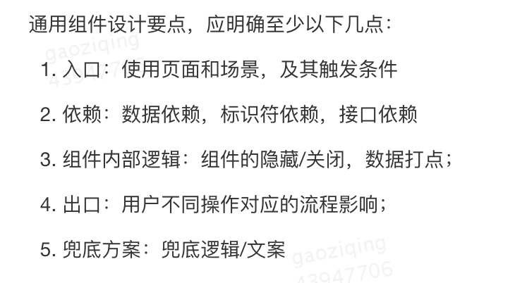

The Code Reviewer's Guide

1. 代码评审的标准

CR的主要目的就是确保公司的代码库的健壮性随着时间增强。所有的CR工具和过程都是为这一目标而设计的。为了达到这个目标，我们要平衡一系列的取舍。

首先，开发者必须要能够在他们的任务上实现代码的优化。如果不提交优化的代码，代码库永远也不会改良。另外，评审者在CR时提出的问题过于刁钻，也会抑制开发者make improvements的想法。

另一方面，确保每个CL的质量不会导致代码库健壮程度下降，是评审者的责任。这其实可能很棘手，因为代码库通常会随时间逐渐质量下降，尤其是在团队处于紧迫的时间限制下，他们会认为必须用最快的办法实现目标。

除此之外，一个评审者要对他们评审的代码有ownership和责任感。他们要确保代码库保持一致性、可维护性，还有所有在"What to look for in a code review."提到的东西。

我们得出了如下的期待作为CR标准的准则：

总体而言，如果一个CL提升了系统整体代码健壮程度，那么评审者应该approve这个CL，即使它不是完美的。

In general, reviewers should favor approving a CL once it is in a state where it definitely improves the overall code health of the system being worked on, even if the CL isn't perfect.

这是CR guidelines的最高优先级的原则。这其中当然有限制，例如，如果CL添加了评审者不想要存在于系统中的特性，即使代码设计良好，评审者也仍然可以否决这个CL。关键在于没有“完美”的代码 "perfect" code——只有更好的代码 better code。评审者不应要求作者润饰每一处细小的代码。相反，评审者应该平衡提升质量的需要和按他们提出的改动建议修改这两者的重要性。一个评审者应该追求的不是完美无暇，而是持续进步continuous improvement. 

一个提升项目代码可维护性、可读性、可理解性的CL不应该仅仅因为它不够完美而被拖延几天或几周。评审者可以自在地指出一些可以改进的东西，但如果那不是非常重要，可以加个前缀Nit，来让开发者知晓那是一个用于润饰的可忽略的点。

注意：本文不支持必然会让代码健壮程度恶化的CL。唯一可能允许的情况的是面临emergency的时候。

指导

CR有一个重要的功能，那就是教给开发者一些关于开发语言、框架、整体软件设计原则等等的新知识。帮助开发者学习新的东西永远是OK的。分享知识本就是让系统代码健壮度随时间提升的一部分。只需要记住一个问题，如果你的评论是纯分享性的，不是帮助改善代码以贴合本文档所描述的标准的关键部分的，记得加个Nit的前缀，或者指明这个问题不是作者必须在这个CL中修复的。

原则

Technical facts and data overrule opinions and personal preferences.技术事实、数据要优先于观点和个人偏好。

关于风格，style guide 是绝对权威。任何不在style guide中的纯风格问题（空格等）是个人偏好问题。代码风格应该和style guide保持一致。如果某类代码在style guide中没有先例，就接受作者的代码风格。

Aspects of software design are almost never a pure style issue or just a personal preference. 软件设计的层面几乎从不是一个纯风格问题或个人偏好问题。这些层面是基于深层的准则，并且需要基于这些准则衡量，而不是简单地根据个人观点。有时一个逻辑、流程等的实现有多种有效方法，如果作者可以通过数据或基于扎实的工程原则表明几个方法都有效且效果相当，那么评审者应当接受作者的个人偏好。否则最终应该由软件设计的标准原则决定。

如果没有其他适用的准则，只要不损害系统整体代码健壮程度，评审者可以要求作者和代码库中现有的代码写法保持一致，

解决冲突

在CR中如果遇到了任何冲突，第一步应当是开发者和评审者一起尝试根据本文档或 The CL Author's Guide and this Reviewer Guide中其他文档的内容达成共识。

如果达成共识很困难，评审者与作者可以进行面对面的会议或VC，而不是试图通过CR评论来解决冲突（如果你还是决定这么做，记得为了方便未来其他读者阅读，在CL里的一条评论中记录讨论结果）。

如果那还是解决不了问题，最常用的方法是扩大影响。通常可以推广到更大的团队讨论，让一个TL加入，请教代码库的maintainer，或者请求工程经理的建议。不要因为评审者和开发者不能达成一致意见就把CL晾在那儿。

2. 在代码评审中要关注的内容

注意: 要记住，确认以下每一点时要把 代码评审的标准 考虑在内。

设计

在一个review中最重要的要cover的东西是CL的整体设计。关于设计的问题有：CL中的不同代码段的相互作用是否清晰明了？这个变动属于你的codebase还是一个库？这个CL能否和系统的剩余部分整合良好？现在是不是添加这个功能的好时候？等等。

后端接口定义，及时和后端沟通需求实现流程、边界场景、兜底及容错方案等等

尽量使用自定义组件：一些页面中自定义组件和template混杂，定位template对应的js逻辑和wxml需要耗费额外的时间

通用组件设计CheckList


需要注意的一些细节

url的拼接和参数的获取，以及重定向的encode和decode相关

ES7、8、9等新API在各移动端的兼容性

等等......

功能

这个CL是否实现了开发者想要实现的东西？开发者的意图是否对这部分代码的“用户”有益？“用户”通常包括终端用户（当他们被这个变动影响时）还有开发者（他们未来会“使用”这部分代码）。

大多数情况下，我们期待开发者对CL进行了足够好的测试因而能够在CR阶段正确运行。然而，作为评审者你仍然应该考虑边界case，寻找并发问题，试图像用户一样思考，并确保没有只通过阅读代码就能发现的bug。

```javascript
// ...
module.exports = (state = defaultState, action) => {
  initVeduxOpts(state);
  switch (action.type) {
    case USER_STORE: {
      // ...
      return assign({}, _state, {
        [CONST.VEDUX_OPTS]: action.options, // good
      });
    }
    // ...
      return assign({}, defaultState, {
        [CONST.VEDUX_OPTS]: { lazy: false }, // bad
      });
    // ...
  }
};
```
另一个在CR中考虑功能性的重要阶段是CL中存在理论上可能导致死锁或竞争条件race condition的并行编程parallel programming的时候。这些issue很难只通过运行代码检测到，并且通常需要开发者和评审者来谨慎地认真考虑、想透，来确保上述问题不会发生。（注意这也是一个可能存在竞争条件或死锁时不使用并发模型的好理由——CR会变得困难，代码也可能难以理解） 。

复杂度

这个CL是否过于复杂？在这个CL的每一层确认这一点——个别代码行是否写得太复杂？函数太复杂？class太复杂？“太复杂”通常意味着“无法被代码读者快速理解”。它也可能意味着“开发者可能会在调用或修改这段代码时引入缺陷”。

```html
<!--预计送达-->
<view class="snd_desc" wx:if="{{!self_delivery_area && !!expected_arrival_time && (statusData.order_status==4 || statusData.order_status==6)}}">
  <image class="clock-icon" src="https://img.meituan.net/kangaroox/5224788c9376e9e43f6b32bf8c4dd2221805.jpg"></image> {{expected_arrival_time}}{{status_operate_area.delivery_time ? ':' : ''}}
  <view class="snd_desc_time">{{status_operate_area.delivery_time ? status_operate_area.delivery_time : ''}}</view>
</view>
<!--倒计时-->
<view class="snd_desc" wx:if="{{status_operate_area.operator_time_type == 2 && operator_countdown_time}}">
  <image class="clock-icon" src="https://img.meituan.net/kangaroox/5224788c9376e9e43f6b32bf8c4dd2221805.jpg"></image> {{status_operate_area.operator_tip}}:
  <view class="snd_desc_time count_down_time">{{operator_countdown_time}}</view>
</view>
```


一个典型的复杂度问题是过度设计over-engineering。开发者让代码过于通用，或者添加系统当下并不需要的功能。评审者尤其应该警惕过度设计。鼓励开发者去解决他们需要立刻解决的问题，而不是开发者推测可能未来需要解决的问题。未来的问题应该在问题来临时解决，因为那时你能才看见它的所有方面。

测试

对改动要求合适的单元、集成或端对端测试。总的来说，CL中也要像生产环境的代码一样添加测试，除非这个CL是处理紧急问题emergency的。 

确保CL里的tests是正确、科学且有用的。测试不会测试它们自身，我们也不会为测试代码写测试代码——开发者必须保证tests是有效的。

代码有问题的时候，测试确实会运行失败吗？如果它们覆盖的代码之外的部分发生了变动，它们会生成错误的通过结果吗？每个test是否都做出了简单有用的断言？test之间是否合适地拆分？

记住tests也是需要维护的代码。不要因为它们不是主包的一部分就不顾复杂度。

命名

开发者是否为一切变量、函数等东西挑选了好的命名？一个好的命名可能要够长来表明对应的东西是什么或者它要做什么，不够长的话可能会变得难以阅读。

注释

开发者是否用可以理解的表达写出了清晰的注释？是否所有的注释都是必要的？通常来说，当注释解释为什么一些代码存在，那么注释是有用的。注释不应该解释一些代码在做什么。如果代码本身不够清晰来解释它自身在做什么，那这样的代码应该要简化。有一些例外，例如正则表达式、复杂的算法等等，解释它们在做什么的注释是有益的。但大多数注释是提供代码本身不能囊括的信息的，例如一个决策背后的推理过程。

看CL之前就存在的注释可能会有帮助。也许有一个TODO可以在这次CL被移除，有一个建议与这次变动相悖的注释，等等。注意，注释与class、module、fucntion的文档不同，应该表达某段代码的目的，应该如何使用这段代码，以及被使用时会如何表现。

```javascript
// good
async loadHistoryStatus() {
  // 参与人无法查看历史状态  ==> 讲清楚了“为什么”
  if (this.data.isPindanParticipant) {
    return;
  }
  // ...
}

// bad
async loadOrderStatus(isHide, options = {}) {
  const result = isNormOrder ? await orderStatus({
    order_view_id: view_id,
  }) : await orderPindanStatus({
    //...
  });
  // 接口迁移兜底   ==> 注释含义不清晰
  this.setStatusDefault(result); // ==> 函数命名模糊
  // ...
}
```
代码风格

在谷歌，我们对所有主流语言都具有style guides, 甚至大部分的冷门语言。确保CL遵循这些原则。

如果你想提升一些不在style guide中的点，对你的comment加个Nit前缀，让开发者知道你认为那是一个可以优化代码的非强制的部分，但不是必需的。不要基于个人的代码风格偏好阻塞CL的提交。

CL的作者不应该把纯style变动和其他变动混合在一起。这会让查看CL中发生的变动变得困难，让merge和回滚操作更复杂，以及导致其他问题。例如，如果作者想格式化整个文件，就让他们把格式化的变动作为单个CL发送给你，之后发送另外的带有功能性变动的CL。

文档

如果一个CL改变了用户构建、测试、调用或发布代码的方式，要检查作者是否更新了相关的文档，包括READMEs、生成的参考文档等等。如果CL删除或废弃了代码，考虑文档是否也应该被删除。如果文档缺失，就向开发者索要对应的文档。

PS: Pocket项目维护者，发布新版本后请留意CHANGELOG的更新。

每一行代码

查看你被指派评审的每一行代码。一些数据文件、生成文件，或大的数据结构，你可以一目十行，但不要匆匆瞥过一个手工写的class，function或者代码段之后假设里面的代码都是okay的。显然一些代码需要更小心的检验scrutiny——你必须对此做出决策，但你至少应该确保你理解所有代码在执行的功能。

如果代码太难阅读，拖延了review的速度，你应该告知开发者这一点，在试图review之前等待他们解释、澄清。 在谷歌，我们雇佣优秀的软件工程师，而你是其中一员。如果你不能读懂某段代码，很可能其他开发者也不能。所以当你请求代码开发者解释代码时，你也在帮助未来的开发者去理解这段代码。

如果你能读懂代码，但你认为自己不能胜任这次CR，就要确保CL的评审者中有一位能够胜任，尤其是对于复杂的issue，比如安全、并发、无障碍功能accessibility、国际化等等。

背景/上下文

从一个更大的范围去看CL往往是有帮助的。通常CR工具只会将变动代码周围的几行代码展示给你。有时你必须查看整个文件来确认这个变动逻辑上正确且有意义。例如，你可能看到只加了4行代码，但当你查看整个文件，你会看到这4行处于一个50行的方法里，那么可能需要把这个方法拆分为几个更小的方法了。

从整个系统环境来看这个CL也很有帮助。这个CL提升了系统的代码健康度，还是让系统更复杂、更经不起测试？不要接受降低系统代码健康度的CL。大部分系统会在多个小变化不断叠加的过程中变得更加复杂，因此避免因为新变动导致复杂度的小幅上升也很重要。

好的东西

如果你发现CL中有亮点，那就告诉开发者，尤其是当他们很好地处理了你的评论的时候。CR通常只专注在错误上，但它们也应该对好的实践表达鼓励和欣赏。在mentor的方面，有时告诉一个开发者他有什么地方做得好比告诉他什么地方做错了更有价值。

总结

在CR过程中，你应该确保:

The code is well-designed. 代码设计良好

The functionality is good for the users of the code. 功能对代码的用户友好

Any UI changes are sensible and look good. UI变动是合理的并且看上去良好

Any parallel programming is done safely. 所有并行编程都是安全地完成的

The code isn't more complex than it needs to be. 代码不过度复杂

The developer isn't implementing things they might need in the future but don't know they need now. 开发者没有在实现他们未来可能需要而现在不需要的东西

Code has appropriate unit tests. 代码有适当的单测

Tests are well-designed. 测试设计良好

The developer used clear names for everything. 开发者对变量、类、函数等命名清晰

Comments are clear and useful, and mostly explain why instead of what. 注释清晰有意义，主要解释why而不是what

Code is appropriately documented (generally in g3doc). 代码被适当地记录在相关文档

The code conforms to our style guides. 代码遵循style guide

Make sure to review every line of code you've been asked to review, look at the context, make sure you're improving code health, and compliment developers on good things that they do.

3. 在评审中检阅变动的方式Navigating a CL in Review

总览

现在你知道要在代码评审中检查什么问题 what to look for，那么对于横跨多个文件的CL，最高效的执行评审的方式是什么呢？

这个变动说得通吗?有好的描述description吗?

先看变动中最重要的部分。它是否有良好的设计？

以恰当的顺序去看其余部分。

第一步：纵观整体改动

查看CL描述CL description 和CL执行的总体工作。如果这个变动一开始就不应该发生，请立即回应并解释为什么这个变动不应该发生。拒绝这样的变动的同时，不妨给开发者提供另外的处理方案的建议。

例如，你可以说 "Looks like you put some good work into this, thanks! However, we're actually going in the direction of removing the FooWidget system that you're modifying here, and so we don't want to make any new modifications to it right now. How about instead you refactor our new BarWidget class?"

注意，这里评审者不止拒绝了这个CL、提供替代方案建议，还做到了礼貌的回应。这种礼仪很重要，因为我们想在即使反对代码时也表明对开发者的尊重。

如果你收到了很多不理想的变动的CL，你应该考虑重新处理你的团队的开发流程或外部贡献者的现有流程，这样在CL被书写前能有更多的沟通。最好在人们写了一通代码最后不得不全部废弃或者哗啦啦重写之前跟他们say no。

第二步Step Two: 检验CL的主体部分

找出CL的主要部分的文件。一般而言，如果有一个文件中有大量的逻辑改动，那么那个文件就是CL的主体部分。一定要先看这些部分。这有助于了解CL中其他小的部分的背景，同时也能加快做代码评审的速度。如果CL太大，你无法得知哪些是主体部分，询问开发者应该先看哪一块，或者让他们拆分CL。

如果你在CL这一部分看到了重大设计问题，即使没时间看剩余的部分也应该立即发出评论。其实，审阅其余部分可能是浪费时间，因为如果设计问题很严重的话，其余的代码无论如何都是要消失掉的。

要立即发出评论的主要原因有以下两个:

开发者通常会在发出CL审阅邀请等待后立刻开始基于该CL的新的工作。如果你审阅的CL中有重大设计问题，那意味着他们后面的CL也要重新改造。所以最好在他们在那个问题设计之上做太多无用功之前抛出问题。

重大设计改造比小改动要花更长的时间。开发者大多有deadline，为了让赶上ddl同时保持代码质量，开发者需要尽快开始CL中大型的重写。

第三步：以合适的顺序浏览CL的剩余部分

一旦确认了CL中没有严重的设计问题之后，尝试理清楚浏览文件的逻辑顺序，同时也确保你没有遗漏任何文件的审阅。查看了最重要的文件后，通常最简单的方式就是按照代码评审工具展示给你的顺序去浏览其他文件。有时阅读主要代码之前先阅读测试代码也有帮助，因为这样你就有了这个变动需要实现的功能的大致概念。

4. 代码评审的速度

代码评审为什么要快？

代码评审者的CR速度过慢的话，以下事情会发生:

团队整体的速度下降。受邀者不快速回应审阅邀请，个人而言确实完成了其他的工作。然而，团队中其余成员的新的feature和bug fix会被拖延了数天甚至上周，因为每个CL需要评审和再评审。

开发者开始反对代码评审流程。如果一个评审者只是每隔几天才回应，但每次都要求大的改动，那会让开发者感到沮丧和困难。通常，他们会抱怨评审者有多“严格”。 如果评审者要求同样的重大改动（改动确实提升代码质量）但是每次开发者更新后都反应快速，抱怨往往会消失。大多数关于代码评审流程的抱怨实际上是通过提升流程的速度解决的。

代码健康度会受到影响。评审速度慢下来，给开发者的压力就增加了，他们会提交不那么好的代码。过慢评审也会抑制代码清洁、重构和对已有CL的进一步优化。

代码评审应该要多快？

如果你不是在全神贯注地执行某项任务，你应该在收到评审邀请后尽快进行代码评审。

处理代码评审邀请的最长反应时间是一个工作日，也就是最晚作为第二天早上的第一件事来处理。

遵循这些守则意味着一个典型的CL应该会在一天之内进行多轮的代码评审。

速度vs打断

个人速度和团队速度存在一个平衡取舍。如果你在进行编写代码等需要集中注意力的任务，不要中断去做代码评审。研究显示开发者在被打断后需要花费更多时间用于回到顺畅的开发工作。

在处理评审邀请前，等待工作中的一个休息点。可以是当前的编码工作完成时，或者是午饭后，从会议室、餐厅等地方回到工位时，等等。

快速反应

当我们谈论代码评审的速度, 我们关心的是反应时间，而不是一个CL经历整个代码评审流程之后被提交的耗时。 对于代码评审的邀请的快速反应比整个代码评审过程快速完成更重要。

即使整个评审过程需要很长时间，评审者在这个过程中的快速反应也可以显著地减轻开发者因为漫长的代码评审等待带来的挫败感。

如果收到了一个CL评审邀请，而你过于忙碌以至于无法进行全面的代码评审，你依然可以快速回复，让开发者知道你会去着手这件事情，或者请求其他有更宽裕时间的评审者进行评审，或者提供一些广泛范围的评论 provide some initial broad comments。(Note: none of this means you should interrupt coding even to send a response like this—send the response at a reasonable break point in your work.)

评审者花费足够的时间确认他们在评审结果给的“LGTM”tag意味着“这段代码符合我们的标准”是很重要的。 无论如何，反馈依然应该保持快速。

带有评论的LGTM

为了提升代码评审过程的速度，在以下情况，即使代码评审者在CL中留下了未解决的评论，他们也应当给出 LGTM/Approval:

评审者对开发者回适当地解决所有遗留评论中提出地问题有充足地自信。

遗留的问题都是细微的，不需要由开发者完成。 

如果评审者先前没有说明，他们应当明确指出自己更倾向以上的哪些选项。在开发者和评审者处于不同时区时，这种处理尤其值得考虑。

大型CL

如果有人让你审阅一个改动相当大范围的CL，而且你不确定自己是否有充足的时间去评审，一般而言可以要求开发者把CL拆分成更小的互相依赖的CL split the CL into several smaller CLs 。

如果一个CL无法被拆分成更小的CL，同时你也没有时间去快速评审整个CL，那么至少写一些关于CL的整体设计的评论，发给开发者用于改进。作为评审者你的目标之一是在不损害代码健康度的情况下，推动他们去快速地进行一些进一步的改善。

代码评审的逐渐进步

如果你遵循这些指导并且对代码评审保持严格，你会发现整个代码评审流程的速度逐渐提升。开发者学习到健康代码的要点，给你提交的CL一开始就有了高质量，因而需要的评审时间也越来越短。评审者学习到快速反应，不给评审过程增添不必要的延迟时间。但是不要为了臆想的速度提升在代码评审标准code review standards或质量上妥协—长远来看这不会让任何事情完成得更快。

紧急情况下代码评审必须尽快完成，那么评审的标准就可以相对放松。不过请浏览 What Is An Emergency? 来确认符合紧急情况的情景。

5. How to Write Code Review Comments

6. Handling Pushback in Code Reviews

[The Change Author's Guide](https://github.com/google/eng-practices/blob/master/review/developer/index.md)

1. Writing Good CL Descriptions

一个CL描述是一篇关于变动是什么和为什么做出变动的公开记录。它会成为我们的版本控制历史的永久性的一部分，随着时间流逝，还可能会被除了你的评审者之外的上百人阅读。

未来的开发者会根据CL描述来搜寻你的CL。有需要的人不必记住具体细节，只需凭借模糊的相关记忆就能很方便地找到你的CL。而如果所有重要信息都在代码里而不在description里，定位到你的CL会变得困难很多。

首行

Short summary of what is being done. 所完成的事情的简短概述

Complete sentence, written as though it was an order. 完整的句子，像命令一样书写

Follow by empty line. 接下来是空白行

CL描述的首行应该针对CL做了什么做一个简短的概述，下面带一行空白行。这是大部分未来代码查阅者会在浏览一段代码的版本控制历史时所看到的。所以第一行必须要有足够的信息量，让读者不需要去阅读你的代码细节或者是整个CL描述来得知你的CL所做的事情。

传统上，CL描述的第一行是一个完整的句子，像命令（祈使句）一样写下。例如， "Delete the FizzBuzz RPC and replace it with the new system." 而不是"Deleting the FizzBuzz RPC and replacing it with the new system." 不过你不需要在描述的其余部分也写成这样的祈使句。

正文包含有效信息

描述的其余部分应该提供有用的信息。可以包含关于正在解决的问题的简短描述，以及为什么这个CL中的解决方案是最佳的。如果这个方案有任何缺点，那么作者应该在描述中提及这些缺点。除此之外，还可以包含背景信息，例如bug数量，基准衡量结果，以及技术设计文档的链接等相关信息。

如果你放置了外部资源的链接，而未来的读者可能由于访问限制不能获取到这些资源，那么要尽可能提供充分的背景信息来让评审者和未来的读者来理解这个CL。

即使是细微的CL也需要关注到细节。

糟糕的CL描述

"Fix bug"是一个不充分的CL描述。什么bug？你做了什么来修复它？其他的问题描述包括：

"Fix build."

"Add patch."

"Moving code from A to B."

"Phase 1."

"Add convenience functions."

"kill weird URLs."

以上有一部分是真实存在的CL描述。这些描述的作者认为他们提供了有用的信息，但事实上这些并不符合CL描述的要求和目标。

良好的CL描述

下面是一些高质量的CL描述的例子。

功能变化

例子:

>rpc: remove size limit on RPC server message freelist.
>
>Servers like FizzBuzz have very large messages and would benefit from reuse. Make the freelist larger, and add a goroutine that frees the freelist entries slowly over time, so that idle servers eventually release all freelist entries.

第一行描述CL做了些什么。其余部分讲解解决的问题，以及为什么这是一个好的解决方案，还有部分关于具体实现的信息。

重构

例子:

>Construct a Task with a TimeKeeper to use its TimeStr and Now methods.
>Add a Now method to Task, so the borglet() getter method can be removed (which was only used by OOMCandidate to call borglet's Now method). This replaces the methods on Borglet that delegate to a TimeKeeper.
>
>Allowing Tasks to supply Now is a step toward eliminating the dependency on Borglet. Eventually, collaborators that depend on getting Now from the Task should be changed to use a TimeKeeper directly, but this has been an accommodation to refactoring in small steps.
>
>Continuing the long-range goal of refactoring the Borglet.

第一行描述CL做了些什么以及相对过去而言发生了什么变化。其余部分讲解具体的实现，CL的补充信息——这次解决方式不够理想，以及未来可能的改进方向。这个CL也解释了这个变动的原因。

需要一些背景信息的小的CL

例子:

> Create a Python3 build rule for status.py.
>
>This allows consumers who are already using this as in Python3 to depend on a rule that is next to the original status build rule instead of somewhere in their own tree. It encourages new consumers to use Python3 if they can, instead of Python2, and significantly simplifies some automated build file refactoring tools being worked on currently.

第一行描述了这个CL做了些什么。其余部分解释了这个变动的原因，并且提供很多背景信息给评审者。

在提交CL之前回顾CL描述

评审期间CL可能发生重大的变化。在提交CL之前，回顾一下CL描述，以确保描述依然准确反映CL所完成的工作，是非常值得的。

2. Small CLs

为什么要写小的CL？

小的，简单的CL有以下优点：

更快速地完成评审. It's easier for a reviewer to find five minutes several times to review small CLs than to set aside a 30 minute block to review one large CL.

更透彻地完成评审. With large changes, reviewers and authors tend to get frustrated by large volumes of detailed commentary shifting back and forth—sometimes to the point where important points get missed or dropped.

降低引入缺陷的可能性. Since you're making fewer changes, it's easier for you and your reviewer to reason effectively about the impact of the CL and see if a bug has been introduced.

如果被否决不会做太多无用功。If you write a huge CL and then your reviewer says that the overall direction is wrong, you've wasted a lot of work.

更容易合并。Working on a large CL takes a long time, so you will have lots of conflicts when you merge, and you will have to merge frequently.

更容易设计良好。It's a lot easier to polish the design and code health of a small change than it is to refine all the details of a large change.

在评审过程中更不容易被阻塞挂起. Sending self-contained portions of your overall change allows you to continue coding while you wait for your current CL in review.

更容易回滚。A large CL will more likely touch files that get updated between the initial CL submission and a rollback CL, complicating the rollback (the intermediate CLs will probably need to be rolled back too).

注意评审者有仅因CL太大而直接拒绝你的CL的决定权。已经写好之后再拆分一个change会花费很大工作量，或者浪费很多时间争取让评审者接收你的大的cl。 一开始就写小的CL会更方便。

什么是“小”的CL？

总的来说，一个小的CL是one self-contained change. 这意味着:

CL只改动了一个东西just one thing. 这通常是feature的一部分，而不是一次过新增整个feature。和你的评审者一起调研合适的CL大小。

评审者理解这个CL所需要的所有东西都在CL中 (除了未来的开发) ，包括CL描述，现有的codebase，或者是他们已经评审过的CL。

CL合并之后系统会继续面向用户和开发者运行良好。

CL不至于太小以至于它的影响很难理解。如果你添加了一个新的API，你应该在CL中包含这个API的用法，这样评审者能更好理解API会如何使用。这也避免合入了没有用到的API。

“太大”并没有一个严格的规定。100行通常是合理的，1000行通常太大，但最终还是基于你的评审者的判断。CL涉及的文件数量也影响CL的“大小”。一个文件中的200行或许ok，但是横跨50个文件就显得太大了。

记住即使你从一开始写代码时就紧密参与其中，评审者通常不知晓上下文背景。看起来可以接受的CL规模可能对评审者来说难以接受。如果存疑，写比你认为必要的更小的CL。评审者几乎不埋怨CL太小。

大型 CLs 什么时候是OK的？

整个文件的删除可以看成是一行代码变动，因为那不会耗费评审者太长时间。

有时一个大的CL是由你完全信任的自动化重构工具生成的，那么评审者的工作就是sanity check，然后说他们确实想要那个改动。即使有上面的告诫（例如合并和测试），这些CL可以更大。

根据文件集拆分

另一个拆分CL的方法是把需要不同评审者的文件分组。

例如：你发出了一个修改协议buffer的CL，和一个使用那个协议的代码的CL。你必须在提交代码相关的CL之前先提交修改proto的CL，但他们可以同时被审阅。如果这样做，你可能需要将另一个CL的改动通知到两边的评审者，以让他们了解改动的上下文和背景。

又例如：你你提交了代码改动的CL，另一个是使用了那段代码的配置或实验。如果必要话，这种也很容易回滚，因为配置/实验文件被推送到生产环境的速度比代码改动更快。

把重构代码分隔到另一个CL

通常把重构放在与新增特性、缺陷修复等分开的新的CL里是最好的做法。例如，把移动、重命名一个类和修复这个类中的一个bug放在不同的CL里。这让评审者更易于理解每个CL中的变动。

小的改动，例如修改一个本地变量名可以放在新增特性或缺陷修复的CL中。这取决于开发者和评审者对重构包含在同一个CL中是否会让评审变得困难的判断。

将测试代码保留在同一个CL中

避免把测试代码拆分到另外的CL中。即使增加了代码行，也应该把验证你的代码改动的代码放在同一个CL中。

然而，独立的测试修改代码可以先放到另外的CL中，类似重构指导 refactorings guidelines.。那包括：

用新的测试验证之前存在的提交过的代码

重构测试代码 (例如引入helper方法)

引入更大的测试框架代码（例如集成测试）

不要破坏构建

如果你有几个互相依赖的CL，你需要找到方法，确保整个系统在每个CL提交后都保持正常运行。否则你可能会在多个CL提交的期间，甚至因为后面的CL提交出现问题导致更长的时间里破坏面向整个团队的项目的构建。

无法让CL变得足够小?

有时你会遇到CL只能很大的情况——然而这其实并不是对的。实践、练习写小规模CL的作者总是可以找到将功能分解成一系列小的CL的方法。

在写一个大的CL之前，考虑。 和你的同事谈谈，有没有能用小的CL实现功能的方法。Before writing a large CL, consider whether preceding it with a refactoring-only CL could pave the way for a cleaner implementation.  

如果这些选项都走不通（这种情况很罕见），那么在提交评审前，先取得你的评审者的同意，让他们心中有数。在这种情况下，做好经历长时间review的准备，小心不要引入bug，勤快点测试。

WANT_LGTM to clarify the expectation when a CL is sent to multiple reviewers. You can use WANT_LGTM=any (the default behavior) or WANT_LGTM=all to clarify.

How to Handle Reviewer Comments

原文地址：[Google Engineering Practices Documentation](https://github.com/google/eng-practices)

扩展阅读：[Google Style Guides](http://google.github.io/styleguide/)

https://github.com/google/eng-practices/blob/master/review/developer/small-cls.md

https://github.com/google/eng-practices/blob/master/review/emergencies.md

https://www.michaelagreiler.com/wp-content/uploads/2019/09/Code-Review-E-Book-Greiler-V2.pdf