## 小程序渲染原理

所有页面都可以抽象成一棵节点树，每个节点具有自身的属性，包括样式、事件等等。

一般的H5页面：HTML + CSS + JavaScript

小程序：WXML + WXSS + JavaScript
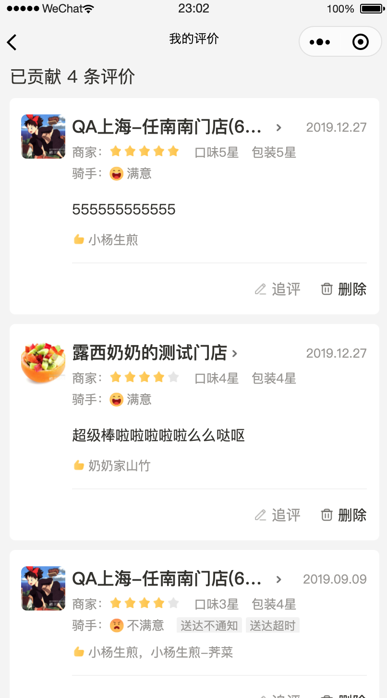
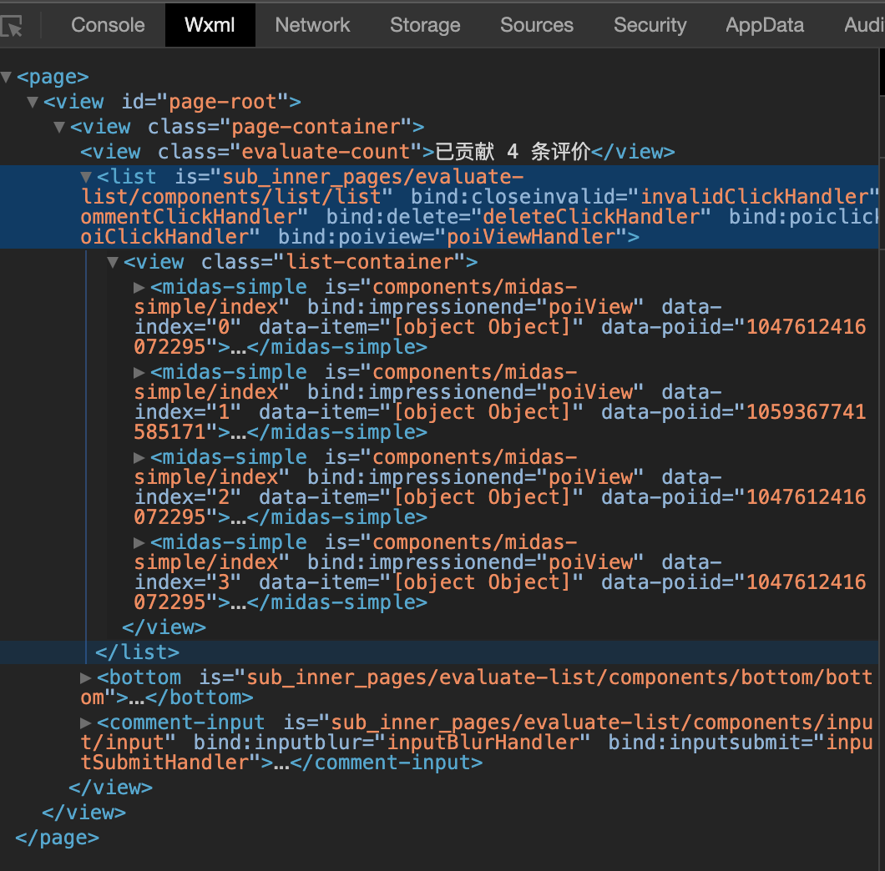
### 技术选型

目前来说，移动端页面渲染的方式主要有三种：

1. Web 渲染。

2. Native 原生渲染。

3. Web 与 Native 两者掺杂，也即我们常说的 Hybrid 渲染。

前面也说过，小程序最终的呈现形式，是 WebView + 原生组件，Hybrid 方式。我们结合之前对小程序的期望来看：

> 开发门槛：Web 门槛低，不过 Native 也有像 RN 这样的框架支持
>
> 体验：Native 体验比 Web 好，Hybrid 在一定程度上比 Web 接近原生体验
>
>版本更新：Web 支持在线更新，Native 则需要打包到微信一起审核发布
>
>管控和安全：Web 可跳转或是改变页面内容，存在一些不可控因素和安全风险

由于小程序的宿主是微信，如果用纯客户端原生技术来编写小程序 ，那小程序代码需要与微信代码一起编包，跟随微信发版本，这种方式跟开发节奏必然都是不对的。所以方向应该是需要像 Web 技术那样，有一份随时可更新的资源包放在云端，通过下载到本地，动态执行后即可渲染出界面。

如果用纯 Web 技术来渲染小程序，在一些有复杂交互的页面上可能会面临一些性能问题。这是因为在 Web 技术中，UI渲染跟 JavaScript 的脚本执行都在一个单线程中执行，这就容易导致一些逻辑任务抢占UI渲染的资源。

总地看来，小程序选择了 Hybrid 的渲染方式，可以用一种近似 Web 的方式来开发，并且还可以实现在线更新代码。同时，引入原生组件有以下好处：

> * 扩展 Web 的能力。比如像输入框组件（input, textarea）有更好地控制键盘的能力
>
> * 体验更好，同时也减轻 WebView 的渲染工作
>
> * 绕过 setData、数据通信和重渲染流程，使渲染性能更好

现在，我们还剩下一个很重要的问题：管控性和安全性。为了解决这些问题，我们需要阻止开发者使用一些浏览器提供的，诸如跳转页面、操作 DOM、动态执行脚本的开放性接口。于是，双线程的设计被提出来了。

在浏览器里，UI 渲染和 JavaScript 逻辑都是在一个线程中执行的。在同一个线程中，UI 渲染和 JavaScript 逻辑交替执行，JavaScript 也可以通过 DOM 接口来对渲染进行控制。

小程序使用的是一种两个线程并行执行的模式，叫做双线程模型，两个线程合力完成小程序的渲染，一个线程专门负责使用WebView渲染工作，我们一般称之为渲染层；而另外有一个线程采用JsCore线程运行JS脚本执行我们的逻辑代码，我们一般叫做逻辑层。一个小程序存在多个界面，所以渲染层存在多个WebView线程，一方面，对于用户来说更加有页面的感觉，体验更好，而且也可以避免单个 WebView 的负担太重；另一方面，将小程序代码运行在独立的线程中的模式有更好的安全表现，允许有像 open-data 这样的组件可以在确保用户隐私的前提下让我们展示用户数据。这两个线程的通信会经由微信客户端（下文中也会采用Native来代指微信客户端）做中转，逻辑层发送网络请求也经由Native转发，小程序的通信模型下图所示。这两个线程同时运行，并通过微信客户端来交换数据：
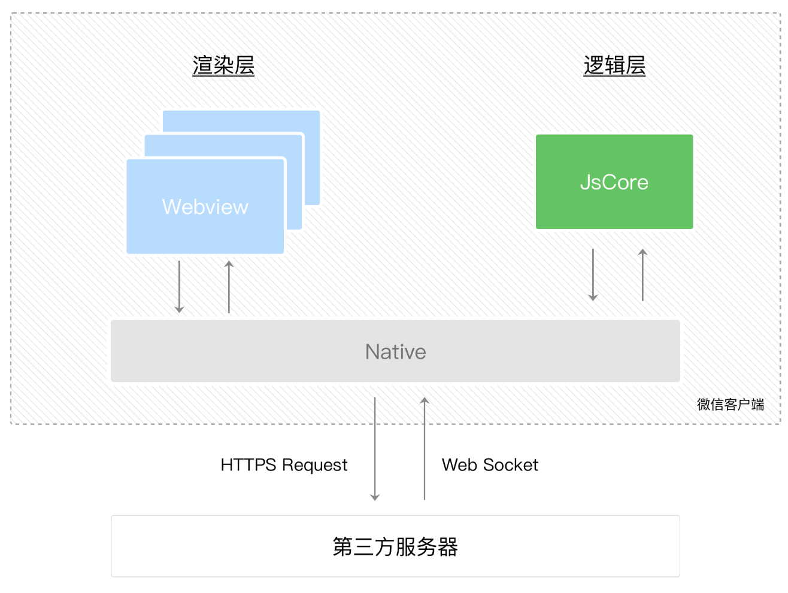
界面的渲染和后台的逻辑处理可以在同一时间运行了，这使得小程序整体的响应速度更快了。而在小程序的运行过程中，逻辑层需要常驻，但渲染层是可以回收的。实际上，当页面栈的层数比较高的时候，栈底页面的渲染层是会被慢慢回收的。

### 双线程通信

把开发者的 JS 逻辑代码放到单独的线程去运行，但在 Webview 线程里，开发者就没法直接操作 DOM。那要怎么去实现动态更改界面呢？

前面我们知道，逻辑层和渲染层的通信会由 Native （微信客户端）做中转，逻辑层发送网络请求也经由 Native 转发。这是不是意味着，我们可以把 DOM 的更新通过简单的数据通信来实现呢？

Virtual DOM 相信大家都已有了解，大概是这么个过程：用JS对象模拟DOM树 -> 比较两棵虚拟DOM树的差异 -> 把差异应用到真正的DOM树上。

WXML结构实际上等价于一棵Dom树，通过一个JS对象也可以来表达Dom树的结构
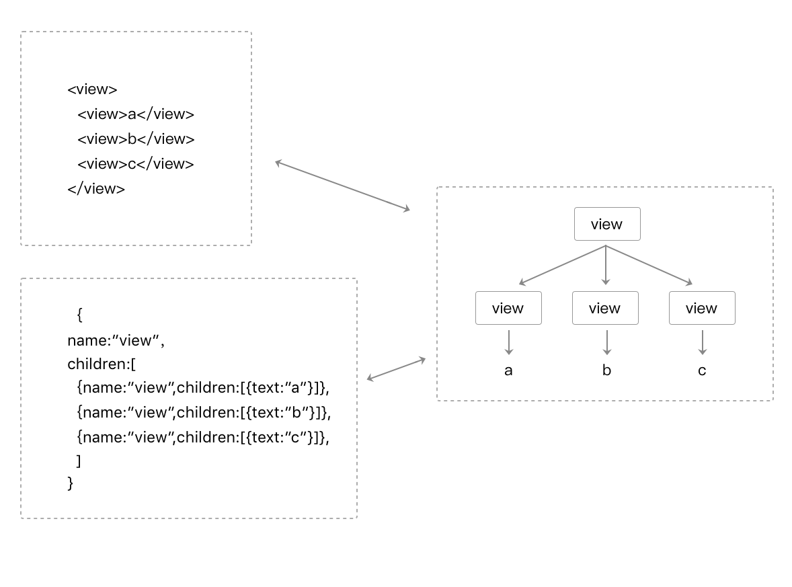
WXML可以先转成JS对象，然后再渲染出真正的Dom树
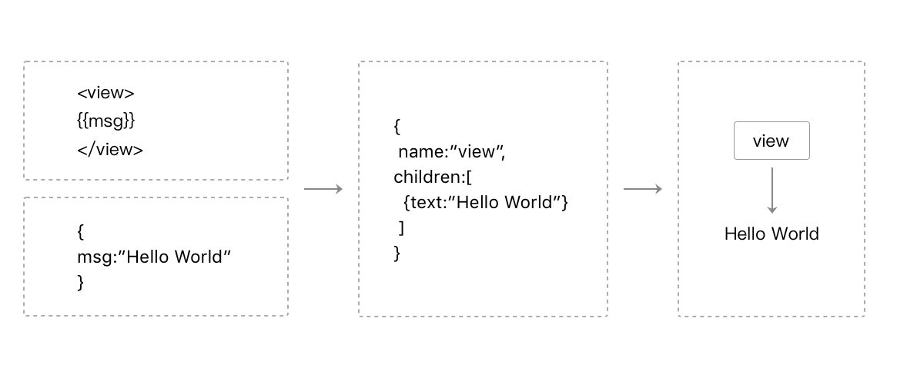
通过setData把msg数据从“Hello World”变成“Goodbye”，产生的JS对象对应的节点就会发生变化，此时可以对比前后两个JS对象得到变化的部分，然后把这个差异应用到原来的Dom树上，从而达到更新UI的目的，这就是“数据驱动”的原理。

在这里我们可以用上，如图：
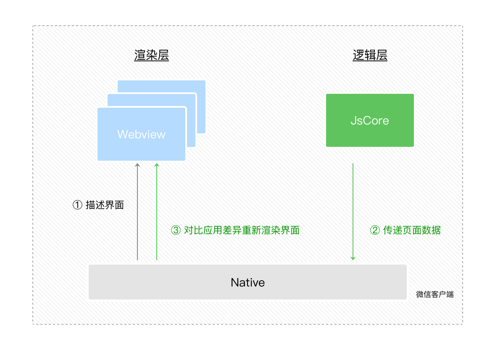
>1. 在渲染层把 WXML 转化成对应的 JS 对象。
>
>2. 在逻辑层发生数据变更的时候，通过宿主环境提供的 setData 方法把数据从逻辑层传递到 Native，再转发到渲染层。
>
>3. 经过对比前后差异，把差异应用在原来的 DOM 树上，更新界面。

我们通过把 WXML 转化为数据，通过 Native 进行转发，来实现逻辑层和渲染层的交互和通信。而这样完整的一套框架，基本上都是通过小程序的基础库来完成的。
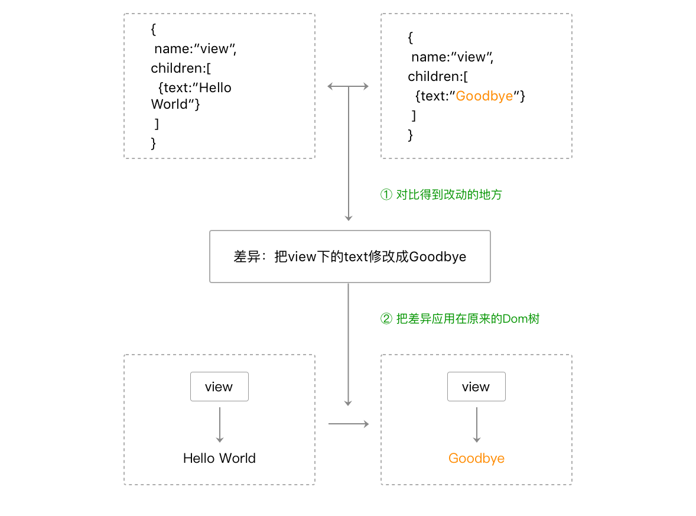
在小程序运行的时候，逻辑层执行我们编写的逻辑，将数据通过 setData 发送到渲染层，举个例子：
```javascript
// packages/loc/city-select/city-select.js 
async query(keyword) {
    this.loading(true);
    let cities = [];
    let isError = false;
    try {
      // 搜索词非空则进行搜索
      if (keyword) {
        const res = await suggestCityList({
          query: keyword,
        });
        cities = res.cities;
      }
    } catch (e) {
      isError = true;
    }
    this.setData({
      searchText: keyword,
      searchResults: cities,
      isSuggestCityNetError: isError,
    });
    this.loading(false);
 },
```
```HTML
<!-- packages/loc/city-select/city-select.wxml -->
<block wx:if="{{searchResults.length !== 0}}">
    <scroll-view scroll-y="" bindscroll="cityScroll" class="search-results-list">
      <view wx:for="{{searchResults}}" wx:key="{{index}}" class="city-item" data-city="{{item}}" bind:tap="onTapSelectCity">
        {{item.cityName}}
      </view>
    </scroll-view>
  </block>
```
而渲染层解析我们的 WXML 和 WXSS，并结合数据渲染出页面。
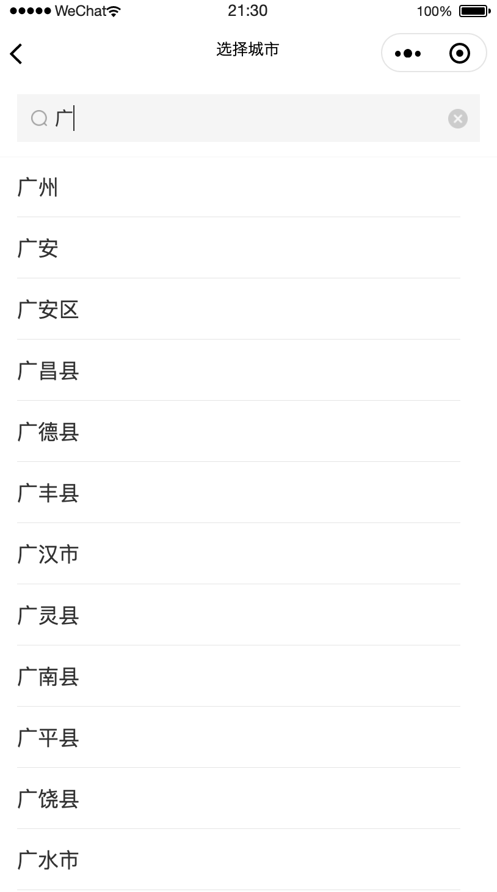

#### 小程序的运行环境
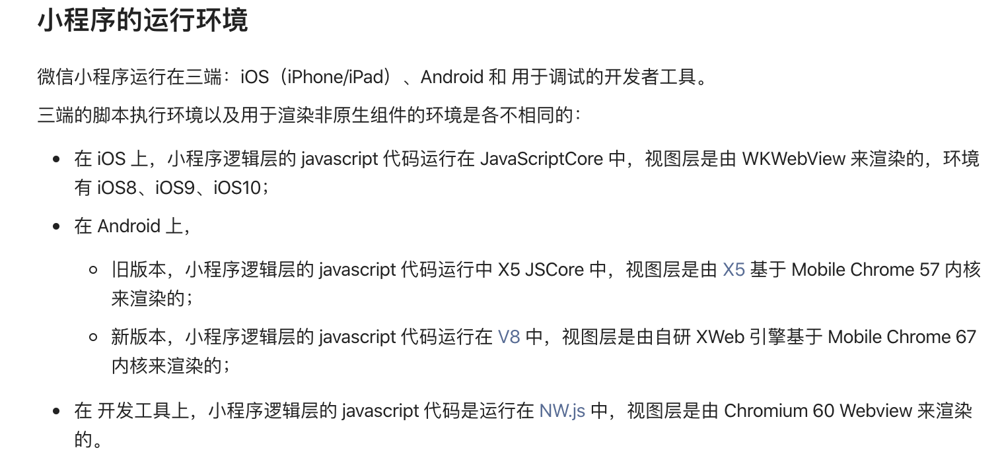

### 原生组件的出现

原生组件的出现，其实与 setData 的机制也有那么点关系，那么就当题外话一块补充下。

#### 频繁交互的性能

我们知道，用户的一次交互，如点击某个按钮，开发者的逻辑层要处理一些事情，然后再通过 setData 引起界面变化。这样的一个过程需要四次通信：

1. 渲染层 -> Native（点击事件）。

2. Native -> 逻辑层（点击事件）。

3. 逻辑层 -> Native（setData）。

4. Native -> 渲染层（setData）。

在一些强交互的场景（表单、canvas等），这样的操作流程会导致用户体验卡顿。

#### 引入原生组件

前面也说过，小程序是 Hybrid 应用，除了 Web 组件的渲染体系（上面讲到），还有由客户端原生参与组件（原生组件）的渲染。

引入原生组件主要有 3 个好处：

1. 绕过 setData、数据通信和重渲染流程，使渲染性能更好。

2. 扩展 Web 的能力。比如像输入框组件（input, textarea）有更好地控制键盘的能力。

3. 体验更好，同时也减轻 WebView 的渲染工作。比如像地图组件（map）这类较复杂的组件，其渲染工作不占用 WebView 线程，而交给更高效的客户端原生处理。

而原生组件的渲染过程：

1. 组件被创建，包括组件属性会依次赋值。

2. 组件被插入到 DOM 树里，浏览器内核会立即计算布局，此时我们可以读取出组件相对页面的位置（x, y坐标）、宽高。

3. 组件通知客户端，客户端在相同的位置上，根据宽高插入一块原生区域，之后客户端就在这块区域渲染界面。

4. 当位置或宽高发生变化时，组件会通知客户端做相应的调整。

简单来说，就是 原生组件在 WebView 这一层只需要渲染一个占位元素，之后客户端在这块占位元素之上叠了一层原生界面。

有利必有弊，原生组件也是有限制的：

* 最主要的限制是一些 CSS 样式无法应用于原生组件

* ~~由于客户端渲染，原生组件的层级会比所有在 WebView 层渲染的普通组件要高~~
微信官方[小程序同层渲染原理剖析](https://developers.weixin.qq.com/community/develop/article/doc/000c4e433707c072c1793e56f5c813?from=singlemessage&isappinstalled=0)
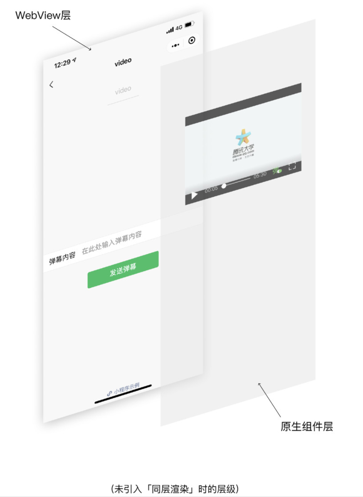
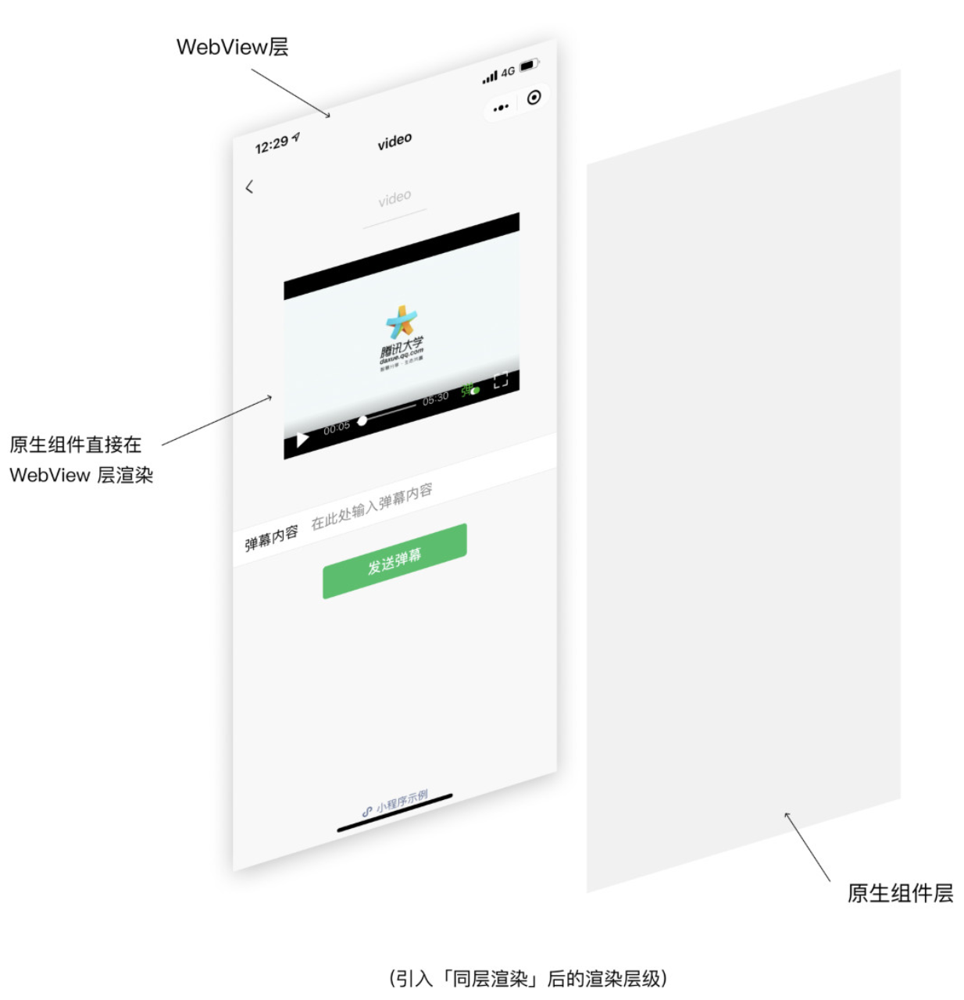
实际上，WebKit 内核并不感知原生组件的存在，因此并非所有的 WXSS 属性都可以在原生组件上生效。一般来说，定位 (position / margin / padding) 、尺寸 (width / height) 、transform (scale / rotate / translate) 以及层级 (z-index) 相关的属性均可生效，在原生组件外部的属性 (如 shadow、border) 一般也会生效。但如需对组件做裁剪则可能会失败，例如：border-radius 属性应用在父节点不会产生圆角效果。

基础库功能

基础库除了处理 VD 的渲染问题，它还包括内置组件和逻辑层API，总的来说负责处理数据绑定、组件系统、事件系统、通信系统等一系列框架逻辑。

小程序的基础库是 JavaScript 编写的，它可以被注入到渲染层和逻辑层运行。在渲染层可以用各类组件组建界面的元素，在逻辑层可以用各类 API 来处理各种逻辑。

同时，小程序的一些补充能力：自定义组件和插件，也有相应的基础代码，当然也需要添加到基础库里。

所以我们可以看到，小程序的基础库主要是：

1. 提供 VD 渲染机制相关基础代码。（Exparser 框架）

2. 提供封装后的内置组件。

3. 提供逻辑层的 API。

4. 提供其他补充能力（自定义组件和插件等）的基础代码。

Exparser 是微信小程序的组件组织框架，内置在小程序基础库中，为小程序的各种组件提供基础的支持。小程序内的所有组件，包括内置组件和自定义组件，都由 Exparser 组织管理。
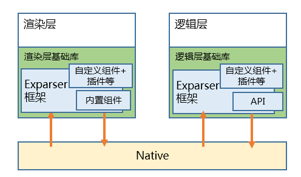
Exparser 特点包括：

>1. 基于 Shadow DOM 模型：模型上与 WebComponents 的 ShadowDOM 高度相似，但不依赖浏览器的原生支持，也没有其他依赖库；实现时，还针对性地增加了其他API以支持小程序组件编程。
>
>2. 可在纯JS环境中运行：这意味着逻辑层也具有一定的组件树组织能力。
>
>3. e高效轻量：性能表现好，在组件实例极多的环境下表现尤其优异，同时代码尺寸也较小。

#### 内置组件

小程序基于 Exparser 框架，内置了一套组件，提供了视图容器类、表单类、导航类、媒体类、开放类等几十种组件。

内置组件在小程序框架里的定义是：在小程序架构里无法实现或者实现不好某类功能，使用组件内置到小程序框架里。常见包括：

* 开放类组件：如 open-data 组件提供展示群名称、用户信息等微信体系下的隐私信息，有 button 组件里 open-type 属性所提供分享、跳转 App 等敏感操作的能力

* 视图容器类组件：如 movable-view 这种因双线程模型导致手势识别不好实现的组件（在双线程模型中，触摸事件从渲染层发出，派发到逻辑层，这中间是有一定的延时而导致视图跟随手指运动这类交互变得有些卡顿）

#### API

宿主环境提供了丰富的API，可以很方便调起微信提供的能力。小程序提供的 API 按照功能主要分为几大类：网络、媒体、文件、数据缓存、位置、设备、界面、界面节点信息还有一些特殊的开放接口。

例如：获取本地缓存信息，获取系统信息，调起微信支付等等。

#### 自定义组件

自定义组件是开发者可以自行扩充的组件。开发者可以将常用的节点树结构提取成自定义组件，实现代码复用。例如上文截图中的midas-simple打点组件。

在使用自定义组件的小程序页面中，Exparser 将接管所有的自定义组件注册与实例化。以 Component 为例：

1. 在小程序启动时，构造器会将开发者设置的 properties、data、methods 等定义段，写入 Exparser 的组件注册表中。

2. 这个组件在被其它组件引用时，就可以根据这些注册信息来创建自定义组件的实例。

Page 构造器的大体运行流程与之相仿，只是参数形式不一样。这样每个页面就有一个与之对应的组件，称为“页面根组件”。在初始化页面时，Exparser 会创建出页面根组件的一个实例，用到的其他组件也会响应创建组件实例（这是一个递归的过程）。

#### 插件

插件是对一组 js 接口、自定义组件或页面的封装，用于嵌入到小程序中使用。

插件不能独立运行，必须嵌入在其他小程序中才能被用户使用；而第三方小程序在使用插件时，也无法看到插件的代码。因此，插件适合用来封装自己的功能或服务，提供给第三方小程序进行展示和使用。

插件开发者可以像开发小程序一样编写一个插件并上传代码，在插件发布之后，其他小程序方可调用。小程序平台会托管插件代码，其他小程序调用时，上传的插件代码会随小程序一起下载运行。

## 基础库机制

#### 基础库的载入

在开发网页时，经常会引用很多开源的 JS 库，在使用到这些库所提供的 API 前，我们需要先在业务代码前边引入这些库。

同样道理，我们需要在启动 APP 之前载入基础库，接着再载入业务代码。由于小程序的渲染层和逻辑层是两个线程管理，而我们 一般说起基础库，也通常包括 WebView 基础库（渲染层），和 AppService 基础库（逻辑层）。

显然，所有小程序在微信客户端打开的时候，都需要注入相同的基础库。所以，小程序的基础库不会被打包在某个小程序的代码包里边，它会被提前内置在微信客户端。

将基础库内置在微信客户端，有两个好处：

降低业务小程序的代码包大小。

可以单独修复基础库中的Bug，无需修改到业务小程序的代码包。

#### 小程序的启动

在小程序启动前，微信会提前准备好一个页面层级用于展示小程序的首页。这里就包括了逻辑层和渲染层分别的初始化以及公共库的注入。
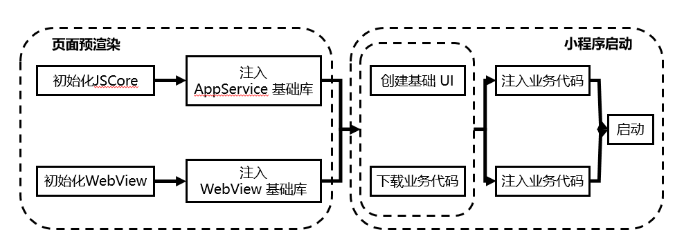

在小程序启动时，微信会为小程序展示一个固定的启动界面，界面内包含小程序的图标、名称和加载提示图标。此时，微信会在背后完成几项工作：下载小程序代码包、加载小程序代码包、初始化小程序首页。
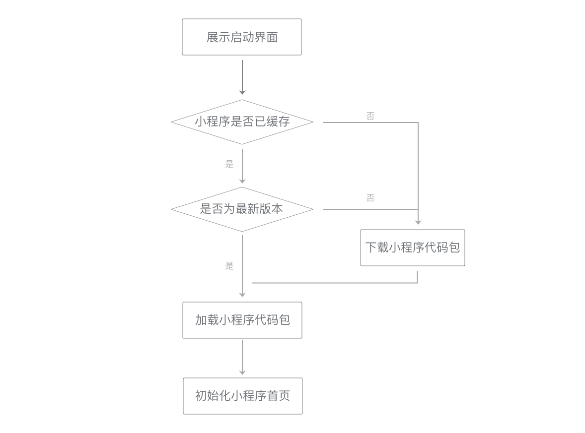

#### 基础库更新

为了避免新版本的基础库给线上小程序带来未知的影响，微信客户端都是携带 上一个稳定版 的基础库发布的。

在新版本客户端发布后，再通过后台灰度新版本基础库，灰度时长一般为 12 ～ 24 小时，在灰度结束后，用户设备上才会有新版本的基础库。

以微信 6.5.8 为例，客户端在发布时携带的是 1.1.1 基础库（6.5.7 上已全量的稳定版）发布，在 6.5.8 发布后，我们再通过后台灰度 1.2.0 基础库。

[查看基础库版本分布](https://developers.weixin.qq.com/miniprogram/dev/framework/client-lib/version.html)

#### 基础库与客户端之间的关系

小程序的能力需要微信客户端来支撑，每一个基础库都只能在对应的客户端版本上运行，高版本的基础库无法兼容低版本的微信客户端。通常：

第 1（major）、2（minor）位版本号更新通常需要依赖新版本的客户端，如：基础库 v2.1.3 运行在 v6.6.7 客户端，基础库 v2.2.0 需要 v6.7.0 客户端。

第 3（patch） 位版本号的更新一般不需要依赖客户端更新，如：基础库v2.1.0 ~ v2.1.3 都运行在 v6.6.7 客户端，新版本发布会覆盖旧版本。

关于基础库的兼容方法，可以查看「[兼容处理](https://developers.weixin.qq.com/miniprogram/dev/framework/compatibility.html)」章节。

基础库更新日志：https://developers.weixin.qq.com/miniprogram/dev/framework/release/

参考资料：

[小程序的底层框架](https://godbasin.github.io/2018/09/02/wxapp-technology-architecture/)

[解剖小程序的 setData](https://godbasin.github.io/2018/10/05/wxapp-set-data/)

[小程序自定义组件知多少](https://godbasin.github.io/2019/02/23/wxapp-component/)

[神奇的Shadow DOM](https://aotu.io/notes/2016/06/24/Shadow-DOM/index.html)

[小程序没有 DOM 接口，原因竟然是……？](https://developers.weixin.qq.com/community/develop/article/doc/000462336ccf080229a9eb37c59413)

[小程序同层渲染原理剖析](https://developers.weixin.qq.com/community/develop/article/doc/000c4e433707c072c1793e56f5c813?from=singlemessage&isappinstalled=0)

[关于小程序的基础库](https://godbasin.github.io/2018/09/23/wxapp-basic-lib/)

[2.4 JavaScript 脚本](https://developers.weixin.qq.com/ebook?action=get_post_info&token=935589521&volumn=1&lang=zh_CN&book=miniprogram&docid=000a8806958588cb00862bd5851c0a)