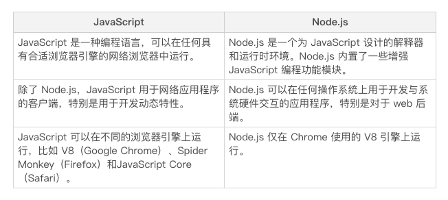

临阵磨枪，不快也光。对于成功的编程面试来说，准备和知识面一样重要。准备使你有信心参加面试，而不用担心莫名的紧张情绪。如果第一次参加编程面试，这一点尤其重要。

为帮助 Node.js 开发人员更好的面试，我列出了 15 个常见的 Node.js 和网络开发相关的面试问题。

在本文中，我们将重点讨论 Node.js 相关问题。但是，请记住 JavaScript 问题在 Node.js 面试中也经常问到，所以准备一些对你来说没什么坏处。不久前我们写了一篇关于常见 JavaScript 面试问题的帖子，涵盖了所有这些基础。

https://livecodestream.dev/post/20-common-javascript-interview-questions/

现在，让我们深入了解面试中可能会问到的 Node.js 问题。

1. Node.js 与 JavaScript 有什么不同?



2. 什么时候用 Node.js？
Node.js 是**异步**的、**事件驱动**的、**非阻塞**的和**单线程**的，使得它成为开发下面应用程序的完美候选：

* 实时应用程序，如聊天和提供实时更新的应用程序

* 将视频或其他多媒体内容流式传输给大量观众的流式应用程序

* 其他 I/O 密集型应用程序，如协作平台

* 遵循微服务架构的网络后端

然而，Node.js 的特性使得它对于其他类型的应用程序来说不是一个理想的选择。执行 CPU 密集型任务的应用程序（如复杂的数学计算）在使用 CPU 时表现不佳，因为 Node.js 是单线程的。


3. EventEmitter 做了什么？
Node.js 中任何对象发出的事件都是 EventEmitter 类的实例，就像 http 模块。

所有 EventEmitter 类都可以使用 eventEmitter.on() 函数将事件侦听器附加到事件。然后一旦捕捉到这样的事件，就会同步地逐个调用它的侦听器。
```javascript
const events = require("events");
const eventEmitter = new events.EventEmitter();
const eventListener = function(){
  console.log("event triggered");
}
eventEmitter.on("emitted", eventListener);
eventEmitter.emit("emitted");
```

4. 事件循环是什么?
   
单线程的 Node.js 必须是**非阻塞**的，以防止线程阻塞在需要很长时间才能完成的任务上，事件循环负责实现这种非阻塞行为，它使用应用程序线程调度挂起的任务。

Node.js 在任务完成时通过回调来处理异步函数返回的响应。与创建任务的事件类似，任务完成后也会发出一个事件。Node.js 将需要处理的事件添加到事件队列。

事件循环对事件队列中的事件进行迭代，并安排何时执行其关联的回调函数。

5. 流是什么?

Stream 流是从源读取或写入数据并将其传输到连续流目标的管道。有四种类型：

* 可读

* 可写的

* 可读写

* 先写入，再读出来

每个流也是一个 EventEmitter。这意味着流对象可以在流上没有数据、流上有可用数据或流中的数据在程序刷新时发出事件。
```javascript
const fs = require("fs");
const readableStream = fs.createReadStream("test.txt");
let content = "";
readableStream.on("data", (chunk) => {
  content += chunk;
});
readableStream.on("end", () => {
  console.log(content);
});
```
6. readFile 和 createReadStream 函数有什么区别？

readFile 函数异步读取文件的全部内容，并存储在内存中，然后再传递给用户。

createReadStream 使用一个可读的流，逐块读取文件，而不是全部存储在内存中。

与 readFile 相比，createReadStream 使用更少的内存和更快的速度来优化文件读取操作。如果文件相当大，用户不必等待很长时间直到读取整个内容，因为读取时会先向用户发送小块内容。
```javascript
const fs = require("fs");
fs.readFile("test.txt", (err, content) => {
  console.log(content);
});
```

7. 如何处理 Node.js 中未捕获的异常？

我们可以在进程级别捕获应用程序中未捕获的异常。为此将侦听器附加到 process 全局对象：
```javascript
process.on("uncaughtException", (err) => {
  console.log("exception caught: ", err);
});
```
8. Node.js 能否充分利用多核处理器？
（默认的）Node.js 应用程序总是单线程的，即使在多核处理器上运行，应用程序也能只使用一个处理器。

但是 Node.js 的核心模块之一 Cluster 支持 Node.js 应用程序开启多核，允许我们创建多个工作进程，这些进程可以在多个内核上并行运行，并共享一个端口来侦听事件。

每个进程使用 IPC 与主线程通信，并根据需要将服务器句柄传递给其他进程。主进程可以侦听端口本身并以循环方式将每个新连接传递给子进程，也可以将端口分配给子进程以便子进程侦听请求。

9. 反应堆设计模式是什么？
反应堆设计模式是，Node.js 将回调函数（处理程序）附加到每个 I/O 操作，然后创建请求时将处理程序提交给解复用器。

解复用器收集应用程序中发出的每个 I/O 请求，并将它们作为队列中的事件进行排队。这个队列就是我们所说的事件队列。将事件排队后，解复用器返回应用程序线程的控制。

同时，事件循环遍历事件队列中的每个事件，并调用附加的回调来处理事件响应。

这就是 Node.js 中所使用的反应堆模式。

10. 单线程与多线程网络后端相比有哪些好处？

尽管 Node.js 是单线程的，但是大多数用于后端开发的编程语言都提供多线程来处理应用程序操作。而为什么单线程有利于后端开发？

开发人员更容易实现应用程序。我们的应用程序在生产过程中不会突然遇到意外的竞争条件。

单线程应用程序易于扩展。

它们可以毫不延迟地在一个时刻收到的大量用户请求提供服务。相比之下，当流量较大时，多线程后端必须等待线程池中的线程释放，才能为用户请求提供服务。利用 Node.js 的**非阻塞特性**，用户请求不会在单个线程上挂起太长时间（只有在操作不是 CPU 密集型时）。

11.  REPL 是什么？

REPL 代表 Read Eval Print Loop，是一个虚拟环境，可以在其中轻松地运行编程语言。Node.js 带有一个内置的 REPL 来运行 JavaScript 代码，类似于我们在浏览器中用来运行 JavaScript 代码的控制台。

要启动 Node.js REPL，只需在命令行上运行 node，然后写一行 JavaScript 代码，就可以在下一行看到它的输出。

12. process.nextTick 和 setImmediate 有什么区别？
传递给 setImmediate 函数的回调将在事件队列上的下一次迭代中执行。

另一方面，回调传递给 process.nextTick 在下一次迭代之前以及程序中当前运行的操作完成之后执行。在应用程序启动时，开始遍历事件队列之前调用它的回调。

因此，回调 process.nextTick 总是在 setImmediate 之前调用。

下面代码段：
```javascript
setImmediate(() => {
  console.log("first");
})
process.nextTick(() => {
  console.log("second");
})
console.log("third");
```
将按顺序输出：
third
second
first
13. stub 是什么?
测试应用程序时使用 stub，模拟给定组件或模块的行为，你可以将精力集中在要测试的代码部分。通过使用 stub 代替与测试无关的组件，不必担心外部组件会影响结果。

例如，如果正在测试的组件在预期测试的部分之前有一个文件读取操作，则可以使用 stub 来模拟该行为并返回模拟内容，而不用实际读取文件。

在 Node.js 中，我们使用像 Sinon 这样的库来实现（译者注，Sinon 在测试中替换某部分代码，减少测试项编写的复杂度 https://sinonjs.org）。

14. 为什么在 express 中分离“应用程序”和“服务器”是一种好的做法？
通过在 Express 中分离应用程序和服务器，可以将 API 实现与网络相关配置分开。在不执行网络调用的情况下执行 API 测试，保证了更快的测试执行和更好的代码覆盖度量。

要实现这种分离，应该在单独的文件中声明 API 和 server，对应 app.js 和 server.js：

```javascript
// app.js
const express = require("express");
const app = express();
app.use("/", index);
app.use("/contact", contact);
app.use("/user", user);
module.exports = app;
// server.js
const http = require("http");
const app = require("/app");
app.set('port', process.env.PORT);
const http = http.createServer(app);
```
15. 什么是 yarn 和 npm？为什么要用 yarn 代替 npm 呢？
npm 是与 Node.js 自带的默认包管理器，它有一个大型的公共库和私有库，存储在 npm registry 的数据库中（译者注，官方默认中心库 http://registry.npmjs.org/，国内淘宝镜像 http://registry.npm.taobao.org/），用户可以通过 npm 命令行访问该数据库。在 npm 的帮助下，用户可以轻松管理项目中的依赖项。

yarn 也是一个包管理器，为了解决 npm 的一些缺点。yarn 依赖 npm 注册中心为用户提供对包访问。yarn 底层结构基于 npm，如果从 npm 迁移到 yarn，项目结构和工作流不需要大改。

就像之前提到的，在某些情况下，yarn 提供了比 npm 更好的功能。与 npm 不同的是，它会缓存下载的每个包，不必重新下载。

通过校验和验证包的完整性来提供更好的安全性，保证在某个系统上运行的包在任何其他系统中的工作方式完全相同，这就是为什么选择 yarn 而不是 npm 来进行包管理。

### 结论    
在本文中，讨论了 15 个最常见的 Node.js 面试问题，帮助你为下一次面试做准备。知道你可能被问到的问题和答案，面试就不再紧张了。

祝你好运，面试成功！临阵磨枪，不快也光。对于成功的编程面试来说，准备和知识面一样重要。准备使你有信心参加面试，而不用担心莫名的紧张情绪。如果第一次参加编程面试，这一点尤其重要。


参考资料：  
[15 个常见的 Node.js 面试问题及答案](https://mp.weixin.qq.com/s/Zn9BEgoyAwq9bfpoBMUYPA)

