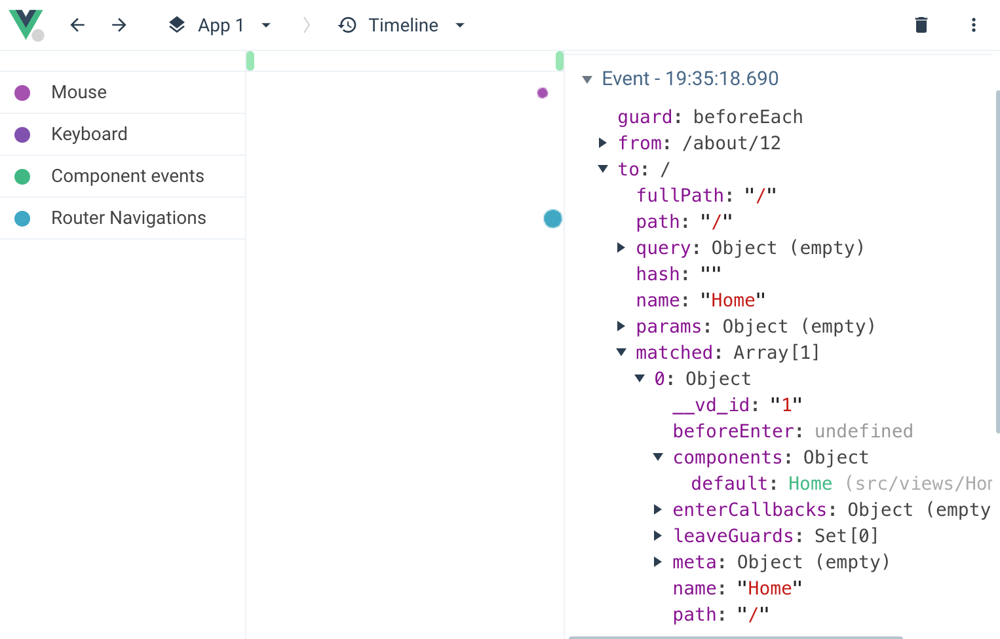
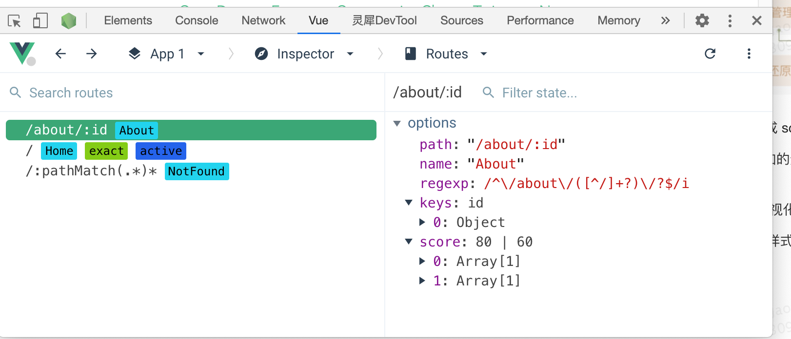

## 项目结构优化
Vue Router 现在分为三个模块：

* History 实现： 处理地址栏，并且特定于 Vue Router 运行的环境（节点，浏览器，移动设备等）
* Router 匹配器：处理类似 /users/:id 的路由解析和优先级处理。
* Router: 将一切连接在一起，并处理路由特定功能，例如导航守卫。

```
|____types
| |____typeGuards.ts // 对route进行校验
| |____index.ts // type和interface
|____router.ts // connects everything together and handle routing specific features like navigation guards
|____RouterLink.ts
|____errors.ts
|____globalExtensions.ts
|____injectionSymbols.ts
|____utils
| |____callbacks.ts
| |____README.md
| |____index.ts
| |____env.ts
|____devtools.ts
|____location.ts
|____matcher // handles the parsing of routes /users/:id and its ranking
| |____pathTokenizer.ts // path解析器，生成token数组tokenizePath
| |____pathMatcher.ts // 提供createRouteRecordMatcher方法供index调用，在addRoute时创建matcher
| |____pathParserRanker.ts // 对每一个setment计算score
| |____types.ts // 定义RouteRecordNormalized作为RouteRecord
| |____index.ts // 定义并实现RouterMatcher，内部定义matcherMap路由映射；对RouteRecord、RouteProps进行normalize
|____warning.ts
|____RouterView.ts
|____scrollBehavior.ts
|____history // handles the address bar and is specific to the environment Vue Router runs on (Node, Browser, Mobile, etc)
| |____common.ts // 列举一些通用的用于History API的interface、type、enum和在两个模式下通用的方法
| |____hash.ts // hash模式，createWebHashHistory
| |____html5.ts // html5模式，createWebHistory
| |____memory.ts // abstract模式，createMemoryHistory, 记录路由队列、监听器和当前位置，实现router方法。如果发现没有浏览器的 API，路由会自动强制进入这个模式
|____global.d.ts
|____useApi.ts
|____index.ts
|____query.ts
|____encoding.ts
|____navigationGuards.ts // 路由守卫
```


```javascript
// src/history/html5.ts
/**
 * Creates a normalized history location from a window.location object
 * @param location -
 */
function createCurrentLocation(
  base: string,
  location: Location
): HistoryLocation {}
function useHistoryListeners(base: string,
  historyState: ValueContainer<StateEntry>,
  currentLocation: ValueContainer<HistoryLocation>,
  replace: RouterHistory['replace']
){}
function useHistoryStateNavigation(base: string) {}
export function createWebHistory(base?: string): RouterHistory {}

```
## 动态路由
### Vue Router3
```
{
  // 会匹配所有路径
  path: '*'
}
{
  // 会匹配以 `/user-` 开头的任意路径
  path: '/user-*'
}
```
vue-router 3使用 [path-to-regexp](https://github.com/pillarjs/path-to-regexp/tree/v1.7.0
) 作为路径匹配引擎。
有时候，同一个路径可以匹配多个路由，此时，匹配的优先级就按照路由的定义顺序：谁先定义的，谁的优先级就最高。当使用通配符路由时，必须确保路由的顺序是正确的，也就是说含有通配符的路由应该放在最后。路由 { path: '*' } 通常用于客户端 404 错误。如果你使用了History 模式，请确保正确配置你的服务器。

### Vue Router 4
不再使用path-to-regexp，而是使用自己的转化系统。新增了有自动优先级排名的高级路径解析功能，用户新现在可以以随意的顺序定义路由，因为 Router 会根据 URL 字符串表示来猜测应该匹配的路由。
举个例子来说，你同时写了 /users 和 /:w+ 这两个路由：
```javascript
const routes = [
  {
    path: '/users',
    Component: Users
  },
  {
    path: '/:w+',
    Component: NotFound
  }
]
```
那么你当然希望在输入 /users 这个更精确的路径的时候，走上面的规则，而下面则作为兜底规则。在旧版的 Vue Router 中需要通过路由声明的顺序来保证这个行为，而新版则无论你怎样放置，都会按照得分系统来计算该匹配哪个路由。

甚至专门有 [Path Ranker](https://paths.esm.dev/?p=AAMeJSyAwR4UbFDAFxAcAGAIJXMAAA..#)这个网页来帮助你计算路由的优先级得分。
简单来说，越明确的路由排名越高，越模糊则反之，无关顺序，非常有意思。

## 改进后的导航系统
新的导航系统更加具有一致性，它改善了滚动行为的体验，使其更加接近原生浏览器的行为。 它还为用户提供了有关导航状态的几乎更多信息，用户可以用这些信息，通过 ProgressBar和 Modal之类的全局 UI 元素让用户的体验变得更好。
改进动机：
1. 先前的selector默认使用document.querySelector。但是这个API不支持 /^#\d/即以数字开头的id元素，所以vue3团队决定针对这种参数使用getElementById。但是这个API仍不适用于选择某个id元素内的某个class的元素，比如#1one .container。诸如此类的情况都会导致vue-router抛出document.querySelector failed，让用户产生困惑。
```javascript
{ x: number, y: number }
{ selector: string, offset? : { x: number, y: number }}
```
2. 基于Element.scrollTo的参数配置ScrollToOptions，vue-router 4进行了改造
```javascript
// vue router 3
scrollBehavior (to, from, savedPosition) {
  if (to.hash) {
    return {
      selector: to.hash
    }
    // return { x: 0, y: 200 }
  }
}

// native JS
element.scrollTo({
  top: 100,
  left: 100,
  behavior: 'smooth'
});
// vue router 4
const router = new Router({
  scrollBehavior(to, from, savedPosition) {
    // scroll to id `can~contain-special>characters` + 200px
    return {
      el: '#can~contain-special>characters'
      // top relative offset
      top: 200
      // instead of `offset: { y: 200 }`
    }
  }
})
```

## 更强大的 Devtools
多亏了新的[Vue Devtools](https://chrome.google.com/webstore/detail/vuejs-devtools/ljjemllljcmogpfapbkkighbhhppjdbg)，Vue Router 能够和浏览器进行以下更高级的整合。

1. 时间轴记录路由变化：
 
2. 完整 route 目录，能够帮助你轻松进行调试：
 

## 更好的路由守卫
### beforeEach
```javascript
// BAD
router.beforeEach((to, from, next) => {
  if (to.name !== 'Login' && !isAuthenticated) next({ name: 'Login' })
  // 如果用户未能验证身份，则 `next` 会被调用两次
  next()
})
// GOOD
router.beforeEach((to, from, next) => {
  if (to.name !== 'Login' && !isAuthenticated) next({ name: 'Login' })
  else next()
})
```
**确保 next 函数在任何给定的导航守卫中都被严格调用一次。它可以出现多于一次，但是只能在所有的逻辑路径都不重叠的情况下，否则钩子永远都不会被解析或报错。**
和next说拜拜，现在确认跳转不需要再手动执行这个函数了，而是根据你的返回值来决定行为。同样支持异步返回 Promise。

现在的路由守卫 API 更加友好且合理了，可以完美利用 async await 做异步处理，比如这样：

```javascript
router.beforeEach(async (to, from) => {
  // canUserAccess() returns `true` or `false`
  return await canUserAccess(to)
})
```
### 路由独享的守卫
现在beforeEnter支持传入函数数组，便于复用，例如跳转到某个路由后自动去除所有query和hash
```javascript
// vue-router 3
const router = new VueRouter({
  routes: [
    {
      path: '/foo',
      component: Foo,
      beforeEnter: (to, from, next) => {
        // ...
      }
    }
  ]
})
// vue-router 4
function removeQueryParams(to) {
  if (Object.keys(to.query).length)
    return { path: to.path, query: {}, hash: to.hash }
}

function removeHash(to) {
  if (to.hash) return { path: to.path, query: to.query, hash: '' }
}
const routes = [
  {
    path: '/users/:id',
    component: UserDetails,
    beforeEnter: [removeQueryParams, removeHash],
  },
  {
    path: '/about',
    component: UserDetails,
    beforeEnter: [removeQueryParams],
  },
]
```
## 迁移成本低
Vue Router 4 主要致力于于在改善现有 Router 的同时保持非常相似的 API，如果你已经很上手旧版的 Vue Router 了，那你的迁移会做的很顺利，可以查看文档中的完整迁移指南。

## 展望未来
在过去的几个月中，Vue Router 一直稳定而且好用，现在它可以做些更好玩的事儿了：

* 使用现有工具（Vetur，Vite，Devtools 等）得到更好的开发体验。
* 与 Suspense 等现代功能更好地集成。
* RFCs 和社区共同探讨出更好用的 API。
* 开发更轻型的版本。

## Breaking Changes(partial)
### New history option to replace mode
The mode: 'history' option has been replaced with a more flexible one named history. Depending on which mode you were using, you will have to replace it with the appropriate function:

* "history": createWebHistory()
* "hash": createWebHashHistory()
* "abstract": createMemoryHistory()

Here is a full snippet:
```javascript
import { createRouter, createWebHistory } from 'vue-router'
// there is also createWebHashHistory and createMemoryHistory

createRouter({
  history: createWebHistory('/base-directory/'),
  routes: [],
})
```
### Missing required params on named routes
Pushing or resolving a named route without its required params will throw an error:
```javascript
// given the following route:
const routes = [{ path: '/users/:id', name: 'user', component: UserDetails }]

// Missing the `id` param will fail
router.push({ name: 'user' })
router.resolve({ name: 'user' })
```

参考资料：  
[Vue Router 3.0 文档](https://router.vuejs.org/zh/guide/essentials/dynamic-matching.html#%E6%8D%95%E8%8E%B7%E6%89%80%E6%9C%89%E8%B7%AF%E7%94%B1%E6%88%96-404-not-found-%E8%B7%AF%E7%94%B1)
[Vue Router 4.0 release log](https://github.com/vuejs/vue-router-next/releases/tag/v4.0.0)  
[Vue Router 4.0 doc](https://next.router.vuejs.org/)  
[Vue Router Migration](https://next.router.vuejs.org/guide/migration/index.html#breaking-changes)
[Vue Router4 dynamic routing](https://next.router.vuejs.org/guide/advanced/dynamic-routing.html)
[Routes' Matching Syntax](https://next.router.vuejs.org/guide/essentials/route-matching-syntax.html)
[router-scroll-position](https://github.com/vuejs/rfcs/blob/master/active-rfcs/0035-router-scroll-position.md)
[Path Ranker](https://paths.esm.dev/?p=AAMeJSyAwR4UbFDAFxAcAGAIJXMAAA..)
[vue-router-next GitHub repo](https://github.com/vuejs/vue-router-next)
