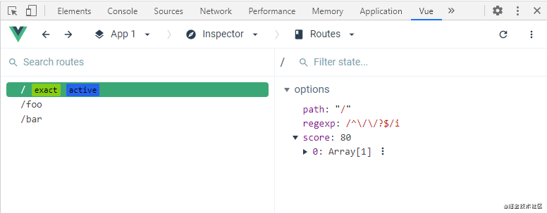

## 项目结构优化
Vue Router 现在分为三个模块：

* History 实现： 处理地址栏，并且特定于 Vue Router 运行的环境（节点，浏览器，移动设备等）
* Router 匹配器：处理类似 /users/:id 的路由解析和优先级处理。
* Router: 将一切连接在一起，并处理路由特定功能，例如导航守卫。
## 动态路由
### Vue Router3
```
{
  // 会匹配所有路径
  path: '*'
}
{
  // 会匹配以 `/user-` 开头的任意路径
  path: '/user-*'
}
```
当使用通配符路由时，请确保路由的顺序是正确的，也就是说含有通配符的路由应该放在最后。路由 { path: '*' } 通常用于客户端 404 错误。如果你使用了History 模式，请确保正确配置你的服务器。
有时候，同一个路径可以匹配多个路由，此时，匹配的优先级就按照路由的定义顺序：谁先定义的，谁的优先级就最高。

vue-router 使用 [path-to-regexp](https://github.com/pillarjs/path-to-regexp/tree/v1.7.0
) 作为路径匹配引擎，所以支持很多高级的匹配模式，例如：可选的动态路径参数、匹配零个或多个、一个或多个，甚至是自定义正则匹配。查看它的文档学习高阶的路径匹配，还有这个例子 展示 vue-router 怎么使用这类匹配。

### Vue Router4
不再使用path-to-regexp，而是使用自己的转化系统。新增了有自动优先级排名的高级路径解析功能，用户新现在可以以随意的顺序定义路由，因为 Router 会根据 URL 字符串表示来猜测应该匹配的路由。
举个例子来说，你同时写了 /users 和 /:w+ 这两个路由：
```javascript
const routes = [
  {
    path: '/users',
    Component: Users
  },
  {
    path: '/:w+',
    Component: NotFound
  }
]
```
那么你当然希望在输入 /users 这个更精确的路径的时候，走上面的规则，而下面则作为兜底规则。在旧版的 Vue Router 中需要通过路由声明的顺序来保证这个行为，而新版则无论你怎样放置，都会按照得分系统来计算该匹配哪个路由。

甚至专门有 [Path Ranker](https://paths.esm.dev/?p=AAMeJSyAwR4UbFDAFxAcAGAIJXMAAA..#)这个网页来帮助你计算路由的优先级得分。
简单来说，越明确的路由排名越高，越模糊则反之，无关顺序，非常有意思。

## 改进后的导航系统
新的导航系统更加具有一致性，它改善了滚动行为的体验，使其更加接近原生浏览器的行为。 它还为用户提供了有关导航状态的几乎更多信息，用户可以用这些信息，通过 ProgressBar和 Modal之类的全局 UI 元素让用户的体验变得更好。

## 更强大的 Devtools
多亏了新的[Vue Devtools](https://chrome.google.com/webstore/detail/vuejs-devtools/ljjemllljcmogpfapbkkighbhhppjdbg)，Vue Router 能够和浏览器进行以下更高级的整合。

1. 时间轴记录路由变化：
 
2. 完整 route 目录，能够帮助你轻松进行调试：
 

## 更好的路由守卫
### beforeEach
```javascript
// BAD
router.beforeEach((to, from, next) => {
  if (to.name !== 'Login' && !isAuthenticated) next({ name: 'Login' })
  // 如果用户未能验证身份，则 `next` 会被调用两次
  next()
})
// GOOD
router.beforeEach((to, from, next) => {
  if (to.name !== 'Login' && !isAuthenticated) next({ name: 'Login' })
  else next()
})
```
**确保 next 函数在任何给定的导航守卫中都被严格调用一次。它可以出现多于一次，但是只能在所有的逻辑路径都不重叠的情况下，否则钩子永远都不会被解析或报错。**
和next说拜拜，现在确认跳转不需要再手动执行这个函数了，而是根据你的返回值来决定行为。同样支持异步返回 Promise。

现在的路由守卫 API 更加友好且合理了，可以完美利用 async await 做异步处理，比如这样：

```javascript
router.beforeEach(async (to, from) => {
  // canUserAccess() returns `true` or `false`
  return await canUserAccess(to)
})
```
### 路由独享的守卫
现在beforeEnter支持传入函数数组，便于复用，例如跳转到某个路由后自动去除所有query和hash
```javascript
// vue-router 3
const router = new VueRouter({
  routes: [
    {
      path: '/foo',
      component: Foo,
      beforeEnter: (to, from, next) => {
        // ...
      }
    }
  ]
})
// vue-router 4
function removeQueryParams(to) {
  if (Object.keys(to.query).length)
    return { path: to.path, query: {}, hash: to.hash }
}

function removeHash(to) {
  if (to.hash) return { path: to.path, query: to.query, hash: '' }
}
const routes = [
  {
    path: '/users/:id',
    component: UserDetails,
    beforeEnter: [removeQueryParams, removeHash],
  },
  {
    path: '/about',
    component: UserDetails,
    beforeEnter: [removeQueryParams],
  },
]
```
## 一致的编码
编码方式（Encoding）做了统一的适配，现在将在不同的浏览器和路由位置属性（params, query 和 hash）中保持一致。router.push是幂等的impodent，及作为参数传递给 router.push() 时，不需要做任何编码，在你使用 $route 或 useRoute()去拿到参数的时候永远是解码（Decoded）的状态。

## 迁移成本低
Vue Router 4 主要致力于于在改善现有 Router 的同时保持非常相似的 API，如果你已经很上手旧版的 Vue Router 了，那你的迁移会做的很顺利，可以查看文档中的完整迁移指南[5]。

## 展望未来
在过去的几个月中，Vue Router 一直稳定而且好用，现在它可以做些更好玩的事儿了：

* 使用现有工具（Vetur，Vite，Devtools 等）得到更好的开发体验。
* 与 Suspense 等现代功能更好地集成。
* RFCs 和社区共同探讨出更好用的 API。
* 开发更轻型的版本。

## Breaking Changes(partial)
### Removed * (star or catch all) routes
Catch all routes (*, /*) must now be defined using a parameter with a custom regex:

```javascript
const routes = [
  // pathMatch is the name of the param, e.g., going to /not/found yields
  // { params: { pathMatch: ['not', 'found'] }}
  // this is thanks to the last *, meaning repeated params and it is necessary if you
  // plan on directly navigating to the not-found route using its name
  { path: '/:pathMatch(.*)*', name: 'not-found', component: NotFound },
  // if you omit the last `*`, the `/` character in params will be encoded when resolving or pushing
  { path: '/:pathMatch(.*)', name: 'bad-not-found', component: NotFound },
]
// bad example if using named routes:
router.resolve({
  name: 'bad-not-found',
  params: { pathMatch: 'not/found' },
}).href // '/not%2Ffound'
// good example:
router.resolve({
  name: 'not-found',
  params: { pathMatch: ['not', 'found'] },
}).href // '/not/found'
```

### Missing required params on named routes
Pushing or resolving a named route without its required params will throw an error:
```javascript
// given the following route:
const routes = [{ path: '/users/:id', name: 'user', component: UserDetails }]

// Missing the `id` param will fail
router.push({ name: 'user' })
router.resolve({ name: 'user' })
```

## 匹配语法
todo  

参考资料：  
[Vue Router 4.0 release log](https://github.com/vuejs/vue-router-next/releases/tag/v4.0.0)  
[Vue Router 4.0 正式发布！焕然一新。](https://mp.weixin.qq.com/s/mBd5ErYcSXnOl7Ib9iwx5Q)  
[Vue Router 3.0 文档](https://router.vuejs.org/zh/guide/essentials/dynamic-matching.html#%E6%8D%95%E8%8E%B7%E6%89%80%E6%9C%89%E8%B7%AF%E7%94%B1%E6%88%96-404-not-found-%E8%B7%AF%E7%94%B1)  
[Vue Router 4.0 doc](https://next.router.vuejs.org/)  
[Vue Router 3 - 4 migration](https://next.router.vuejs.org/guide/migration/index.html#breaking-changes)  
[Vue Router4 dynamic routing](https://next.router.vuejs.org/guide/advanced/dynamic-routing.html)  
[Routes' Matching Syntax](https://next.router.vuejs.org/guide/essentials/route-matching-syntax.html)
